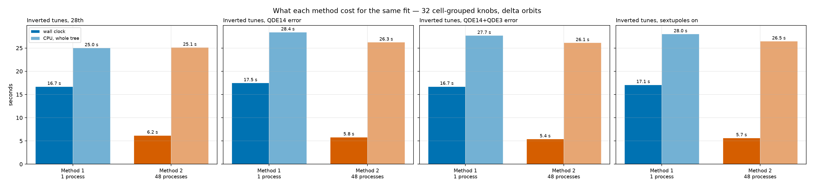
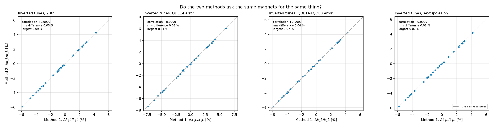

# Method 1 against Method 2

PSB ring 3 · both methods, same 32 cell-grouped knobs, same delta orbits · [method](../../method.md)

## The two runs

=== "Inverted tunes, 28th"

    | | Method 1 | Method 2 |
    |---|---|---|
    | free knobs | 32 cell-grouped $\Delta k_1 L$ over 48 magnets | 32 cell-grouped $\Delta k_1 L$ over 48 magnets |
    | what it fits | the measured response matrix | 48 delta closed orbits |
    | processes | 1 | 48 |
    | wall clock | 16.7 s | 6.2 s |
    | CPU, whole tree | 25.0 s | 25.1 s |
    | peak RSS | 259 MB | 270 MB |
    | stopped at | `XTOL` after 364 calls | its own convergence test |
    | its own residual | weighted response rms 8302.6 → 83.1 | not comparable: a different objective |

=== "Inverted tunes, QDE14 error"

    | | Method 1 | Method 2 |
    |---|---|---|
    | free knobs | 32 cell-grouped $\Delta k_1 L$ over 48 magnets | 32 cell-grouped $\Delta k_1 L$ over 48 magnets |
    | what it fits | the measured response matrix | 48 delta closed orbits |
    | processes | 1 | 48 |
    | wall clock | 17.5 s | 5.8 s |
    | CPU, whole tree | 28.4 s | 26.3 s |
    | peak RSS | 263 MB | 267 MB |
    | stopped at | `XTOL` after 610 calls | its own convergence test |
    | its own residual | weighted response rms 8376.0 → 84.7 | not comparable: a different objective |

=== "Inverted tunes, QDE14+QDE3 error"

    | | Method 1 | Method 2 |
    |---|---|---|
    | free knobs | 32 cell-grouped $\Delta k_1 L$ over 48 magnets | 32 cell-grouped $\Delta k_1 L$ over 48 magnets |
    | what it fits | the measured response matrix | 48 delta closed orbits |
    | processes | 1 | 48 |
    | wall clock | 16.7 s | 5.4 s |
    | CPU, whole tree | 27.7 s | 26.1 s |
    | peak RSS | 258 MB | 269 MB |
    | stopped at | `XTOL` after 397 calls | its own convergence test |
    | its own residual | weighted response rms 8457.2 → 81.9 | not comparable: a different objective |

=== "Inverted tunes, sextupoles on"

    | | Method 1 | Method 2 |
    |---|---|---|
    | free knobs | 32 cell-grouped $\Delta k_1 L$ over 48 magnets | 32 cell-grouped $\Delta k_1 L$ over 48 magnets |
    | what it fits | the measured response matrix | 48 delta closed orbits |
    | processes | 1 | 48 |
    | wall clock | 17.1 s | 5.7 s |
    | CPU, whole tree | 28.0 s | 26.5 s |
    | peak RSS | 259 MB | 270 MB |
    | stopped at | `XTOL` after 463 calls | its own convergence test |
    | its own residual | weighted response rms 8278.6 → 84.4 | not comparable: a different objective |

## What each answer and each run cost

=== "Inverted tunes, 28th"

    The two fits correlate at **+0.9999** over 48 magnets (32 distinct knobs each). Their gradients differ by 0.03 % of nominal $k_1L$ rms, 0.09 % at the worst magnet, against fitted magnitudes of 2.61 % and 2.61 % rms.

    Method 2 finishes **2.7x** faster in wall clock and **1.0x** in CPU, while holding 48 MAD-NG workers to Method 1's one.

=== "Inverted tunes, QDE14 error"

    The two fits correlate at **+0.9999** over 48 magnets (32 distinct knobs each). Their gradients differ by 0.06 % of nominal $k_1L$ rms, 0.11 % at the worst magnet, against fitted magnitudes of 3.43 % and 3.41 % rms.

    Method 2 finishes **3.0x** faster in wall clock and **1.1x** in CPU, while holding 48 MAD-NG workers to Method 1's one.

=== "Inverted tunes, QDE14+QDE3 error"

    The two fits correlate at **+0.9999** over 48 magnets (32 distinct knobs each). Their gradients differ by 0.04 % of nominal $k_1L$ rms, 0.07 % at the worst magnet, against fitted magnitudes of 2.94 % and 2.93 % rms.

    Method 2 finishes **3.1x** faster in wall clock and **1.1x** in CPU, while holding 48 MAD-NG workers to Method 1's one.

=== "Inverted tunes, sextupoles on"

    The two fits correlate at **+0.9999** over 48 magnets (32 distinct knobs each). Their gradients differ by 0.03 % of nominal $k_1L$ rms, 0.07 % at the worst magnet, against fitted magnitudes of 2.86 % and 2.85 % rms.

    Method 2 finishes **3.0x** faster in wall clock and **1.1x** in CPU, while holding 48 MAD-NG workers to Method 1's one.

## Speed and agreement

<figure markdown>

<figcaption>Wall clock and whole-tree CPU for each method, every benchmarked campaign on this page.</figcaption>
</figure>
<figure markdown>

<figcaption>Each magnet's fitted gradient, Method 1 against Method 2.</figcaption>
</figure>

Wall clock is one run on one machine, not a mean over repeats, and the CPU column is the whole process tree as the operating system reports it — for Method 2 that is one worker per corrector setting, started and terminated by the fitter.

Method 1 stops on **XTOL** (`--var-rtol 3e-3`: no knob moves by more than 0.3 % of itself), not on `FMIN`/`FTOL`, since measured BPM bars keep all 384 response cells infeasible by thousands of sigma. Here: inverted tunes, 28th `XTOL` at 364 calls, inverted tunes, qde14 error `XTOL` at 610 calls, inverted tunes, qde14+qde3 error `XTOL` at 397 calls, inverted tunes, sextupoles on `XTOL` at 463 calls. Tightening to 1e-8 costs 4000–6000 extra calls and changes no gradient by more than 2.2e-4 % of nominal $k_1L$, against fitted magnitudes of about 3 %.

---

## Rerunning this page

```bash
uv run python -m scripts.benchmark_methods --campaign inverted_second inverted_qde14_err inverted_qde14_qde3_err inverted_sexts_on
uv run python scripts/analyse_cross_campaign.py --direction inverted
uv run python scripts/plot_cross_campaign.py --direction inverted
uv run python reports/loco_option_matrix/make_pages.py
```
