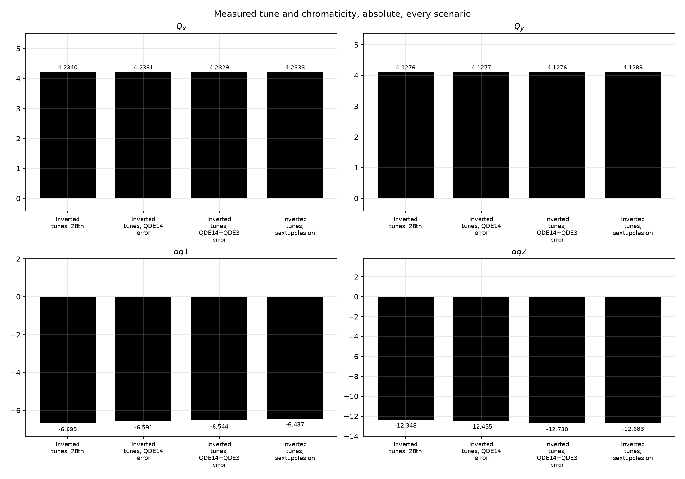
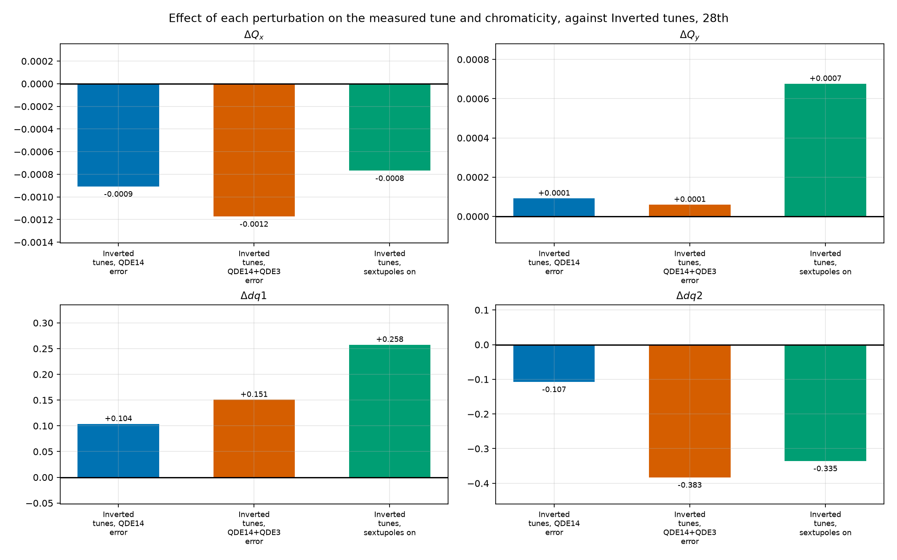
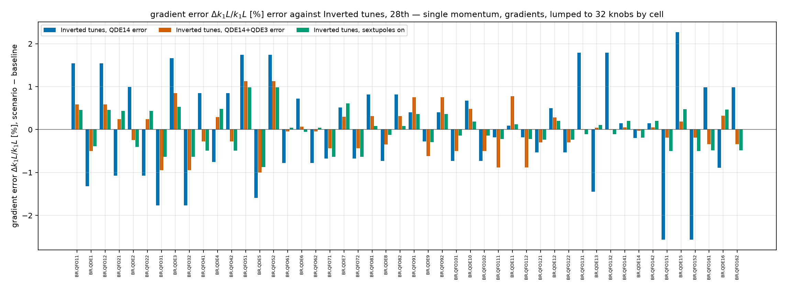
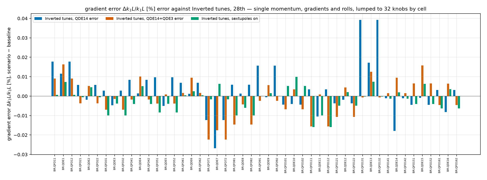
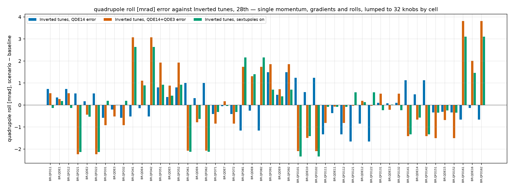
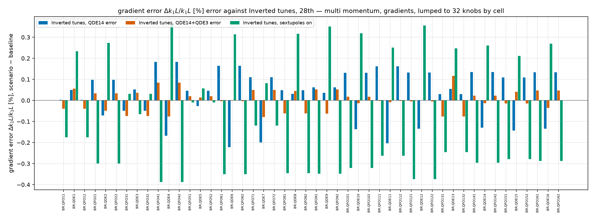
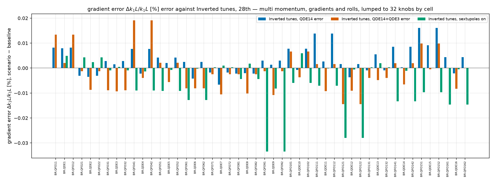
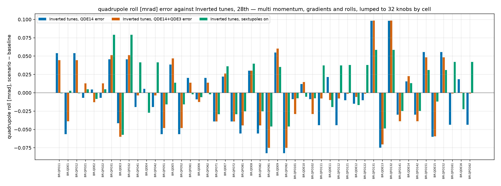

# Scenario comparison — fitted with gradients only

PSB ring 3 · Inverted tunes, 28th baseline against Inverted tunes, QDE14 error, Inverted tunes, QDE14+QDE3 error, Inverted tunes, sextupoles on · [method](../../method.md)

## Tune and chromaticity, absolute

<figure markdown>

<figcaption>Measured tune and chromaticity, absolute, one group of bars per scenario.</figcaption>
</figure>

## Effect of the perturbations

<figure markdown>

<figcaption>Measured tune and chromaticity, each scenario minus the unperturbed baseline.</figcaption>
</figure>

=== "Beta from phase"

    <figure markdown>
    
    <figcaption>Relative, $\Delta\beta/\beta$, from the measured phase. Each scenario minus the unperturbed baseline at the same BPM, along $s$. The left column is measurement against measurement, no model involved; the right is the same difference taken between the LOCO-fitted lattices, multi-momentum, gradients only, lumped to 32 knobs by cell. Measured points carry the two campaigns' bars added in quadrature, and each curve's rms is in the legend.</figcaption>
    </figure>

=== "Beta from amplitude"

    <figure markdown>
    ![The same quantity from the measured amplitude, which needs the BPM gains -- its own tab rather than standing in for the phase one. Each scenario minus the unperturbed baseline at the same BPM, along $s$. The left column is measurement against measurement, no model involved; the right is the same difference taken between the LOCO-fitted lattices, multi-momentum, gradients only, lumped to 32 knobs by cell. Measured points carry the two campaigns' bars added in quadrature, and each curve's rms is in the legend.](../../assets/figures/scenarios/inverted/gradients/scenario_perturbation_beta_amp.png)
    <figcaption>The same quantity from the measured amplitude, which needs the BPM gains -- its own tab rather than standing in for the phase one. Each scenario minus the unperturbed baseline at the same BPM, along $s$. The left column is measurement against measurement, no model involved; the right is the same difference taken between the LOCO-fitted lattices, multi-momentum, gradients only, lumped to 32 knobs by cell. Measured points carry the two campaigns' bars added in quadrature, and each curve's rms is in the legend.</figcaption>
    </figure>

=== "Phase advance"

    <figure markdown>
    
    <figcaption>Absolute, BPM to BPM, in units of $2\pi$. Each scenario minus the unperturbed baseline at the same BPM, along $s$. The left column is measurement against measurement, no model involved; the right is the same difference taken between the LOCO-fitted lattices, multi-momentum, gradients only, lumped to 32 knobs by cell. Measured points carry the two campaigns' bars added in quadrature, and each curve's rms is in the legend.</figcaption>
    </figure>

=== "Dispersion"

    <figure markdown>
    
    <figcaption>Absolute, $\Delta D$ in metres. Each scenario minus the unperturbed baseline at the same BPM, along $s$. The left column is measurement against measurement, no model involved; the right is the same difference taken between the LOCO-fitted lattices, multi-momentum, gradients only, lumped to 32 knobs by cell. Measured points carry the two campaigns' bars added in quadrature, and each curve's rms is in the legend.</figcaption>
    </figure>

=== "Coupling"

    <figure markdown>
    ![Absolute, $\Delta|f_{1001}|$ and $\Delta|f_{1010}|$ from omc3's RDT amplitudes -- the rows are the two resonances, not the two planes. Each scenario minus the unperturbed baseline at the same BPM, along $s$. The left column is measurement against measurement, no model involved; the right is the same difference taken between the LOCO-fitted lattices, multi-momentum, gradients only, lumped to 32 knobs by cell. Measured points carry the two campaigns' bars added in quadrature, and each curve's rms is in the legend.](../../assets/figures/scenarios/inverted/gradients/scenario_perturbation_coupling.png)
    <figcaption>Absolute, $\Delta|f_{1001}|$ and $\Delta|f_{1010}|$ from omc3's RDT amplitudes -- the rows are the two resonances, not the two planes. Each scenario minus the unperturbed baseline at the same BPM, along $s$. The left column is measurement against measurement, no model involved; the right is the same difference taken between the LOCO-fitted lattices, multi-momentum, gradients only, lumped to 32 knobs by cell. Measured points carry the two campaigns' bars added in quadrature, and each curve's rms is in the legend.</figcaption>
    </figure>

## Fitted knob errors against the baseline

=== "Single momentum, gradients, lumped to 32 knobs by cell"

    <figure markdown>
    
    <figcaption>Fitted gradient error against the unperturbed baseline, per magnet, one bar group per scenario.</figcaption>
    </figure>

=== "Single momentum, gradients and rolls, lumped to 32 knobs by cell"

    <figure markdown>
    
    <figcaption>Fitted gradient error against the unperturbed baseline, per magnet, one bar group per scenario.</figcaption>
    </figure>

    <figure markdown>
    
    <figcaption>Fitted roll error against the unperturbed baseline, per magnet, one bar group per scenario.</figcaption>
    </figure>

=== "Multi momentum, gradients, lumped to 32 knobs by cell"

    <figure markdown>
    
    <figcaption>Fitted gradient error against the unperturbed baseline, per magnet, one bar group per scenario.</figcaption>
    </figure>

=== "Multi momentum, gradients and rolls, lumped to 32 knobs by cell"

    <figure markdown>
    
    <figcaption>Fitted gradient error against the unperturbed baseline, per magnet, one bar group per scenario.</figcaption>
    </figure>

    <figure markdown>
    
    <figcaption>Fitted roll error against the unperturbed baseline, per magnet, one bar group per scenario.</figcaption>
    </figure>

## Method 1 against Method 2

How the two fitting methods themselves compare on this baseline is on its own page: [Method 1 against Method 2](benchmark.md).
