# Measured optics

PSB ring 3 · AC-dipole turn-by-turn and the tune/chroma scan · 4 machine configurations, each against the same lattice tune-matched to the measurement. Every beta bar is omc3's propagated error added in quadrature to a bootstrap over the folder's AC-dipole kicks.

## Measured tunes

| configuration | natural $Q_x$ | natural $Q_y$ | model $Q'_H$ / $Q'_V$ | measured $Q'_H$ / $Q'_V$ (XImeter) | measured $Q'_H$ / $Q'_V$ (closed-orbit) |
|---|---|---|---|---|---|
| Inverted tunes, 28th | 4.23404 ± 0.00013 | 4.12758 ± 0.00008 | -3.381 / -6.645 | -3.480 ± 0.020 / -6.418 ± 0.033 | -3.303 ± 0.010 / -6.793 ± 0.003 |
| Inverted tunes, QDE14 error | 4.23314 ± 0.00018 | 4.12767 ± 0.00032 | -3.380 / -6.644 | -3.426 ± 0.016 / -6.473 ± 0.026 | -3.424 ± 0.080 / -6.706 ± 0.042 |
| Inverted tunes, QDE14+QDE3 error | 4.23287 ± 0.00006 | 4.12764 ± 0.00010 | -3.380 / -6.643 | -3.401 ± 0.016 / -6.617 ± 0.033 | -3.447 ± 0.074 / -6.710 ± 0.008 |
| Inverted tunes, sextupoles on | 4.23328 ± 0.00016 | 4.12826 ± 0.00021 | -3.380 / -6.645 | -3.346 ± 0.022 / -6.592 ± 0.038 | -3.296 ± 0.032 / -6.830 ± 0.040 |

## ACDipole config

=== "Inverted tunes, 28th"

    | folder | measured $q_{xd}$ / $q_{yd}$ | set | spread | acquisitions |
    |---|---|---|---|---|
    | `0mm` | 0.230502 / 0.130996 | 0.2305 / 0.1310 | 9.2e-04 / 2.2e-03 | 67 |
    | `m2mm` | 0.234702 / 0.139496 | 0.2347 / 0.1395 | 6.2e-07 / 1.6e-06 | 52 |
    | `2mm` | 0.226503 / 0.122793 | 0.2265 / 0.1228 | 2.2e-06 / 2.5e-06 | 55 |

    Optics from `0mm`.

=== "Inverted tunes, QDE14 error"

    | folder | measured $q_{xd}$ / $q_{yd}$ | set | spread | acquisitions |
    |---|---|---|---|---|
    | `0mm` | 0.229701 / 0.131397 | 0.2297 / 0.1314 | 4.1e-07 / 8.5e-07 | 74 |
    | `m2mm` | 0.234201 / 0.139897 | 0.2342 / 0.1399 | 1.0e-06 / 2.0e-06 | 56 |
    | `2mm` | 0.225702 / 0.123296 | 0.2257 / 0.1233 | 1.6e-05 / 2.1e-03 | 50 |

    Optics from `0mm`.

=== "Inverted tunes, QDE14+QDE3 error"

    | folder | measured $q_{xd}$ / $q_{yd}$ | set | spread | acquisitions |
    |---|---|---|---|---|
    | `0mm` | 0.229401 / 0.131597 | 0.2294 / 0.1316 | 3.2e-07 / 7.0e-07 | 30 |
    | `m2mm` | 0.233901 / 0.139996 | 0.2339 / 0.1400 | 6.0e-07 / 1.5e-06 | 39 |
    | `2mm` | 0.225402 / 0.123496 | 0.2254 / 0.1235 | 9.4e-07 / 2.4e-06 | 30 |

    Optics from `m2mm`.

=== "Inverted tunes, sextupoles on"

    | folder | measured $q_{xd}$ / $q_{yd}$ | set | spread | acquisitions |
    |---|---|---|---|---|
    | `0mm` | 0.229802 / 0.131895 | 0.2298 / 0.1319 | 5.4e-07 / 1.2e-06 | 30 |
    | `m2mm` | 0.234001 / 0.140295 | 0.2340 / 0.1403 | 6.7e-07 / 1.5e-06 | 30 |
    | `2mm` | 0.225802 / 0.123494 | 0.2258 / 0.1235 | 4.9e-07 / 1.6e-06 | 30 |

    Optics from `0mm`.

## Across configurations

<figure markdown>

<figcaption>Measured beta-beating along s against each reference model, from phase (filled) and from amplitude (open).</figcaption>
</figure>

## Measured against the model

=== "Inverted tunes, 28th"

    <figure markdown>
    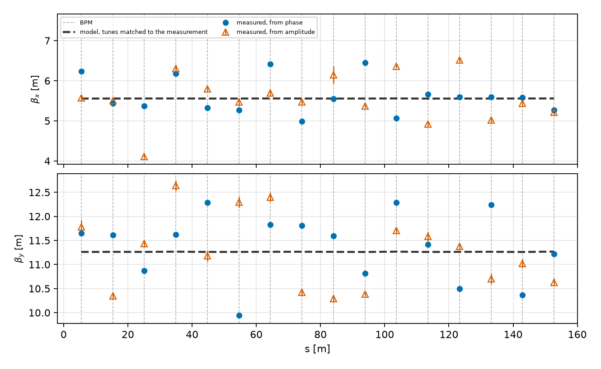
    <figcaption>Measured beta from phase and from amplitude, against the tune-matched model.</figcaption>
    </figure>

    <figure markdown>
    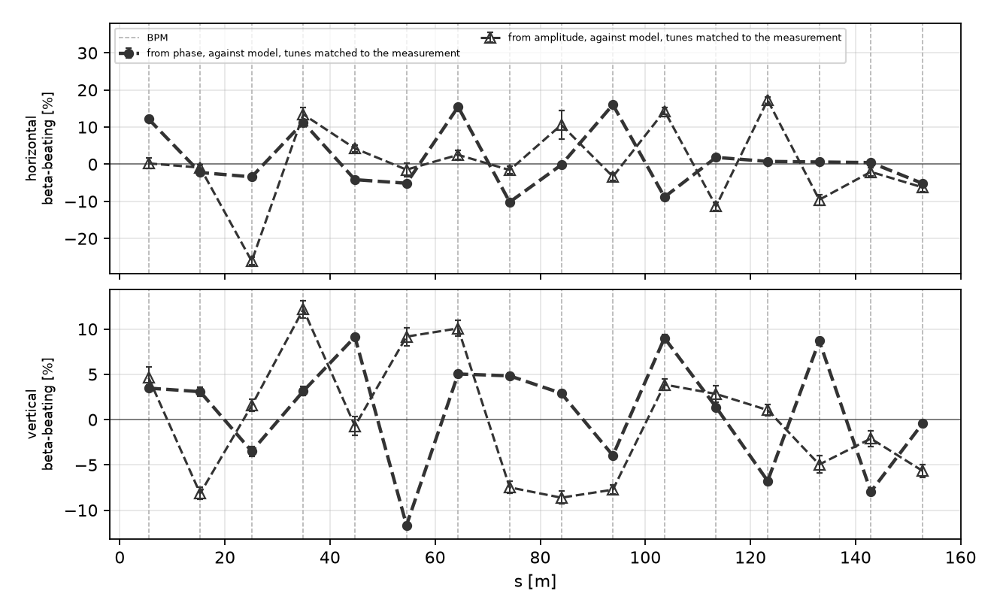
    <figcaption>Measured beta-beating against the tune-matched model, both planes.</figcaption>
    </figure>

    <figure markdown>
    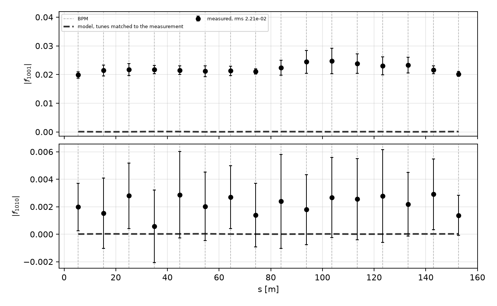
    <figcaption>Measured |f1001| and |f1010| against the tune-matched model.</figcaption>
    </figure>

    <figure markdown>
    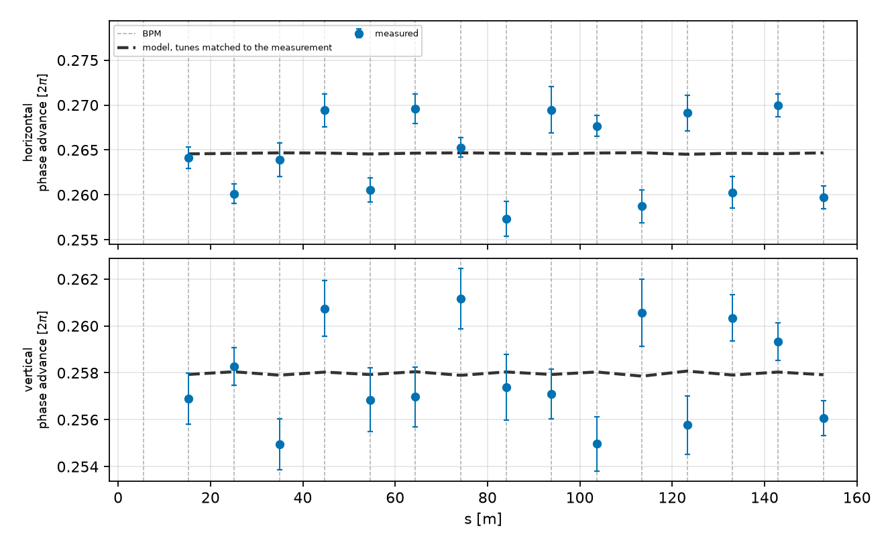
    <figcaption>Measured phase advance between adjacent BPMs against the tune-matched model, both planes.</figcaption>
    </figure>

=== "Inverted tunes, QDE14 error"

    <figure markdown>
    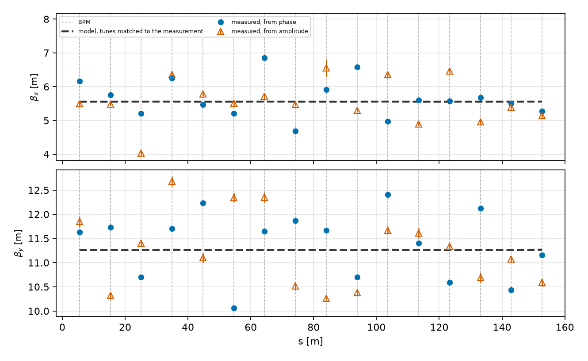
    <figcaption>Measured beta from phase and from amplitude, against the tune-matched model.</figcaption>
    </figure>

    <figure markdown>
    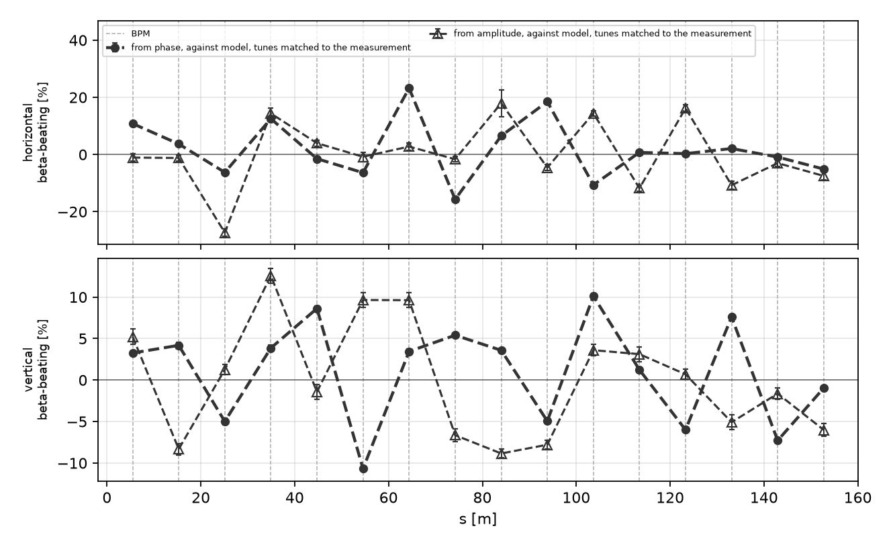
    <figcaption>Measured beta-beating against the tune-matched model, both planes.</figcaption>
    </figure>

    <figure markdown>
    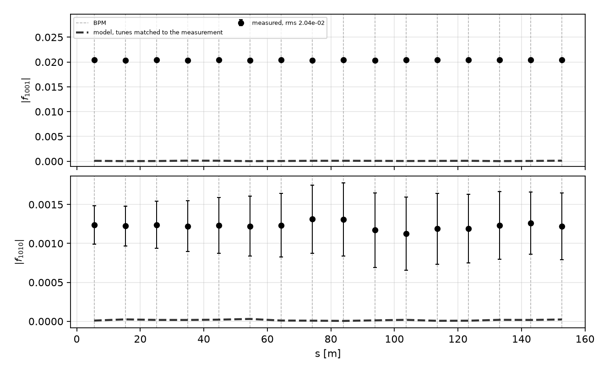
    <figcaption>Measured |f1001| and |f1010| against the tune-matched model.</figcaption>
    </figure>

    <figure markdown>
    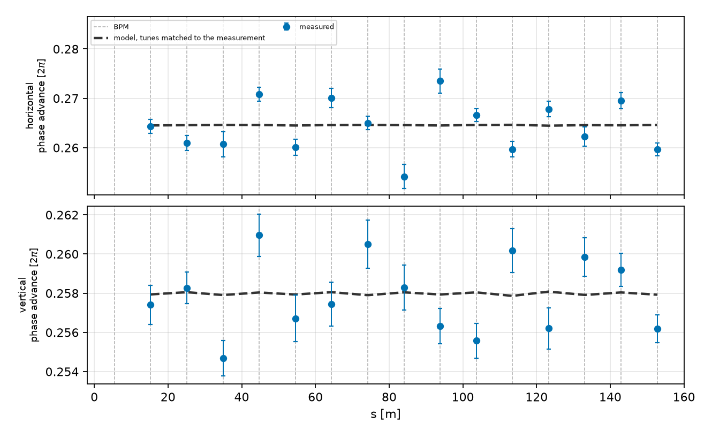
    <figcaption>Measured phase advance between adjacent BPMs against the tune-matched model, both planes.</figcaption>
    </figure>

=== "Inverted tunes, QDE14+QDE3 error"

    <figure markdown>
    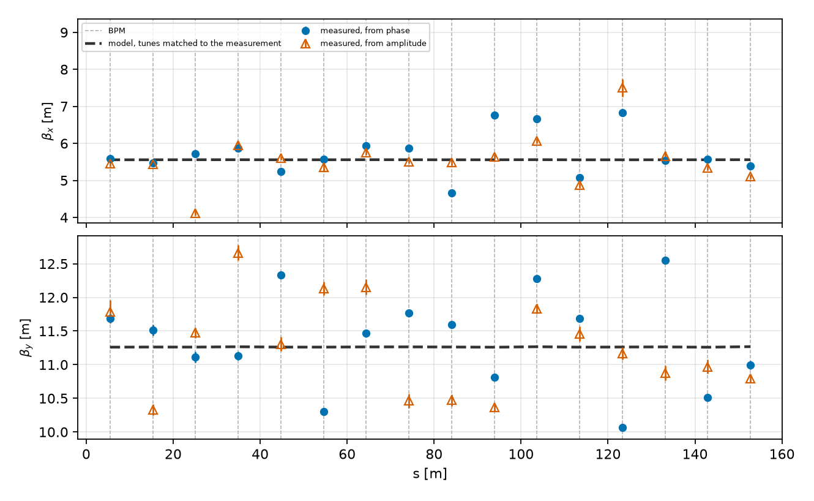
    <figcaption>Measured beta from phase and from amplitude, against the tune-matched model.</figcaption>
    </figure>

    <figure markdown>
    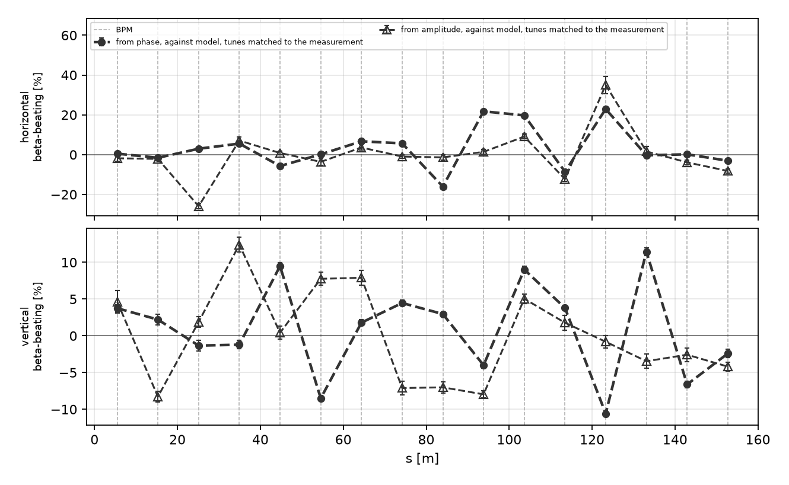
    <figcaption>Measured beta-beating against the tune-matched model, both planes.</figcaption>
    </figure>

    <figure markdown>
    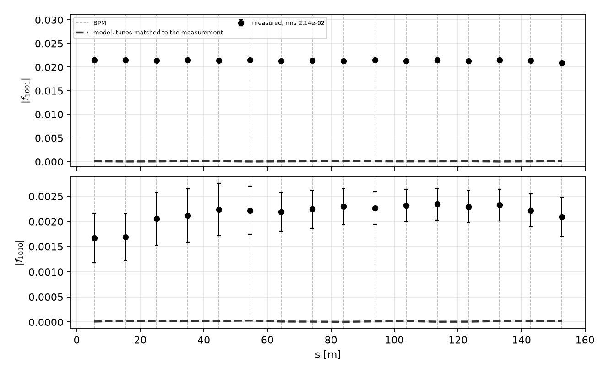
    <figcaption>Measured |f1001| and |f1010| against the tune-matched model.</figcaption>
    </figure>

    <figure markdown>
    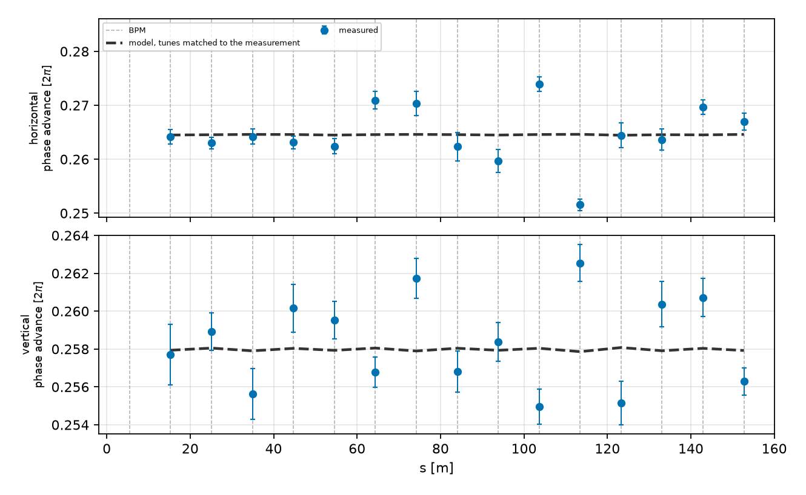
    <figcaption>Measured phase advance between adjacent BPMs against the tune-matched model, both planes.</figcaption>
    </figure>

=== "Inverted tunes, sextupoles on"

    <figure markdown>
    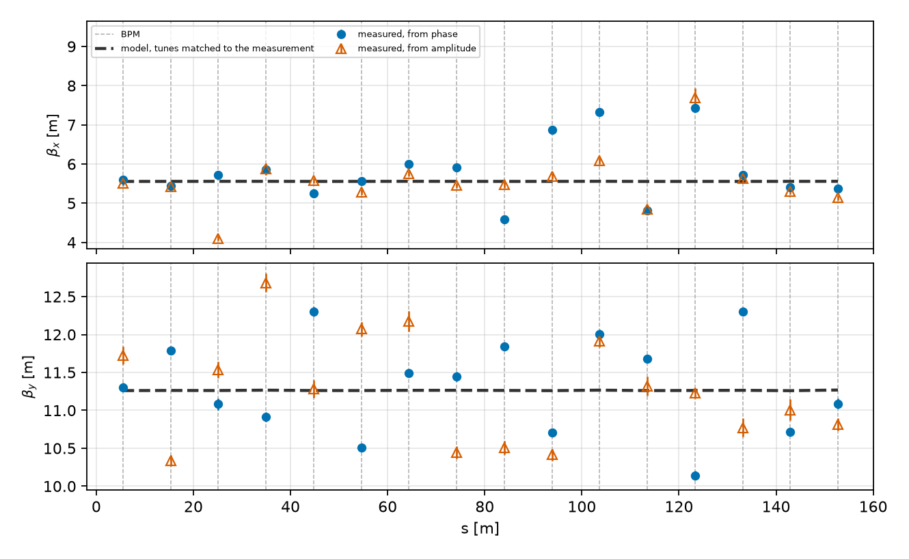
    <figcaption>Measured beta from phase and from amplitude, against the tune-matched model.</figcaption>
    </figure>

    <figure markdown>
    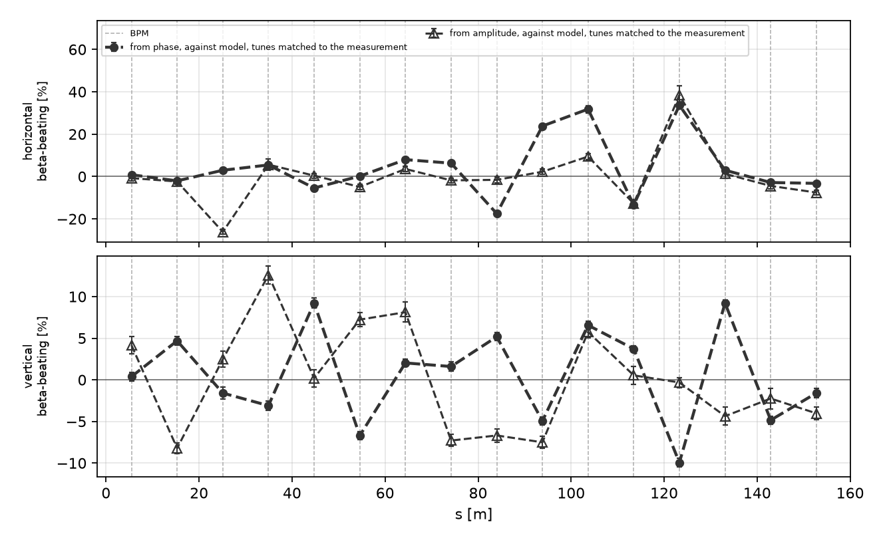
    <figcaption>Measured beta-beating against the tune-matched model, both planes.</figcaption>
    </figure>

    <figure markdown>
    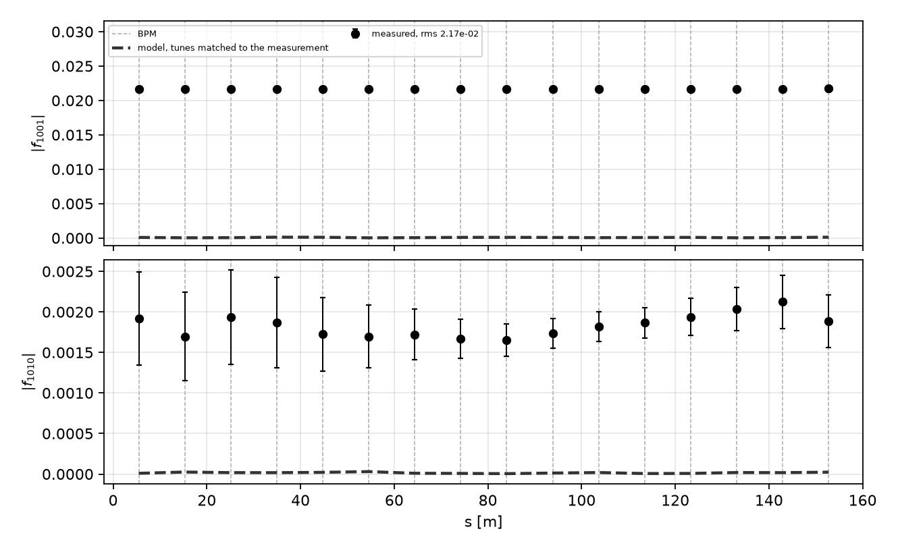
    <figcaption>Measured |f1001| and |f1010| against the tune-matched model.</figcaption>
    </figure>

    <figure markdown>
    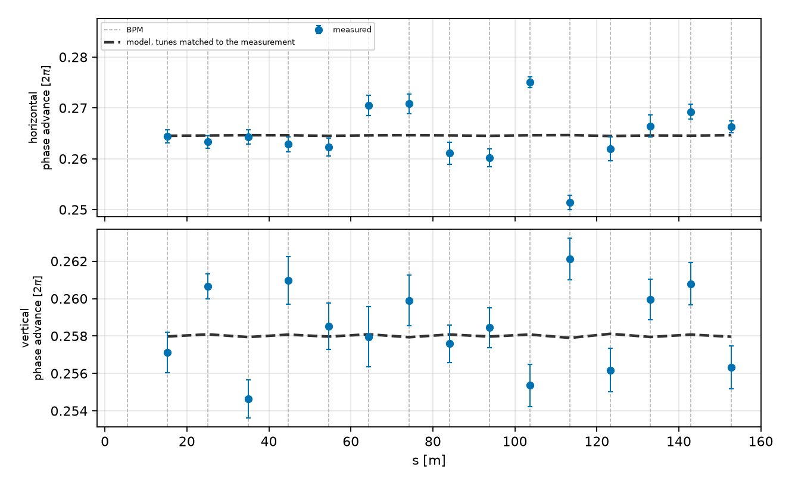
    <figcaption>Measured phase advance between adjacent BPMs against the tune-matched model, both planes.</figcaption>
    </figure>
