# Measured optics

PSB ring 3 · 2026-08-21 · AC-dipole turn-by-turn and the tune/chroma scan · [method](../../method.md)

!!! note "What the beta error bars mean"

    Every bar on this page is omc3's propagated error added in quadrature to a bootstrap over the folder's AC-dipole kicks: the kicks are resampled with replacement and the optics stage rerun on each replica. omc3's bar alone comes from one pooled analysis and contains no repeat of the machine, so it misses the shot-to-shot spread entirely; on its own it is 3-5 times too small for the phase beta. The bootstrap in turn cannot see anything common to the whole folder -- the kick normalisation and BPM calibration the amplitude beta leans on -- which is why the two are added rather than one replacing the other.

## The machine

=== "Inverted tunes, 28th, nominal"

    | quantity | value | spread across the flat bottom |
    |---|---|---|
    | natural tune $Q_x$ / $Q_y$ | 4.23404 / 4.12758 | 1.3e-04 / 8.3e-05 |
    | $dq1=dQ_x/dp_t$ / $dq2=dQ_y/dp_t$ | -6.695 / -12.348 | 0.038 / 0.063 (fit $1\sigma$) |
    | QFO / QDE circuit, MAD $k_1$ | 0.7395237891 / -0.7377586523 | sent to the magnets |

=== "Inverted tunes, 28th, matched"

    | quantity | value | spread across the flat bottom |
    |---|---|---|
    | natural tune $Q_x$ / $Q_y$ | 4.23404 / 4.12758 | 1.3e-04 / 8.3e-05 |
    | $dq1=dQ_x/dp_t$ / $dq2=dQ_y/dp_t$ | -6.695 / -12.348 | 0.038 / 0.063 (fit $1\sigma$) |
    | QFO / QDE circuit, MAD $k_1$ | 0.7395237891 / -0.7377586523 | sent to the magnets |

=== "Inverted tunes, QDE14 error, nominal"

    | quantity | value | spread across the flat bottom |
    |---|---|---|
    | natural tune $Q_x$ / $Q_y$ | 4.23314 / 4.12767 | 1.8e-04 / 3.2e-04 |
    | $dq1=dQ_x/dp_t$ / $dq2=dQ_y/dp_t$ | -6.591 / -12.455 | 0.031 / 0.051 (fit $1\sigma$) |
    | QFO / QDE circuit, MAD $k_1$ | 0.7395237891 / -0.7377586523 | sent to the magnets |

=== "Inverted tunes, QDE14 error, matched"

    | quantity | value | spread across the flat bottom |
    |---|---|---|
    | natural tune $Q_x$ / $Q_y$ | 4.23314 / 4.12767 | 1.8e-04 / 3.2e-04 |
    | $dq1=dQ_x/dp_t$ / $dq2=dQ_y/dp_t$ | -6.591 / -12.455 | 0.031 / 0.051 (fit $1\sigma$) |
    | QFO / QDE circuit, MAD $k_1$ | 0.7395237891 / -0.7377586523 | sent to the magnets |

=== "Inverted tunes, QDE14+QDE3 error, nominal"

    | quantity | value | spread across the flat bottom |
    |---|---|---|
    | natural tune $Q_x$ / $Q_y$ | 4.23287 / 4.12764 | 5.8e-05 / 1.0e-04 |
    | $dq1=dQ_x/dp_t$ / $dq2=dQ_y/dp_t$ | -6.544 / -12.730 | 0.030 / 0.063 (fit $1\sigma$) |
    | QFO / QDE circuit, MAD $k_1$ | 0.7395237891 / -0.7377586523 | sent to the magnets |

=== "Inverted tunes, QDE14+QDE3 error, matched"

    | quantity | value | spread across the flat bottom |
    |---|---|---|
    | natural tune $Q_x$ / $Q_y$ | 4.23287 / 4.12764 | 5.8e-05 / 1.0e-04 |
    | $dq1=dQ_x/dp_t$ / $dq2=dQ_y/dp_t$ | -6.544 / -12.730 | 0.030 / 0.063 (fit $1\sigma$) |
    | QFO / QDE circuit, MAD $k_1$ | 0.7395237891 / -0.7377586523 | sent to the magnets |

=== "Inverted tunes, sextupoles on, nominal"

    | quantity | value | spread across the flat bottom |
    |---|---|---|
    | natural tune $Q_x$ / $Q_y$ | 4.23328 / 4.12826 | 1.6e-04 / 2.1e-04 |
    | $dq1=dQ_x/dp_t$ / $dq2=dQ_y/dp_t$ | -6.437 / -12.683 | 0.042 / 0.074 (fit $1\sigma$) |
    | QFO / QDE circuit, MAD $k_1$ | 0.7395237891 / -0.7377586523 | sent to the magnets |

=== "Inverted tunes, sextupoles on, matched"

    | quantity | value | spread across the flat bottom |
    |---|---|---|
    | natural tune $Q_x$ / $Q_y$ | 4.23328 / 4.12826 | 1.6e-04 / 2.1e-04 |
    | $dq1=dQ_x/dp_t$ / $dq2=dQ_y/dp_t$ | -6.437 / -12.683 | 0.042 / 0.074 (fit $1\sigma$) |
    | QFO / QDE circuit, MAD $k_1$ | 0.7395237891 / -0.7377586523 | sent to the magnets |

## AC-dipole drive

=== "Inverted tunes, 28th, nominal"

    | folder | measured $q_{xd}$ / $q_{yd}$ | set | spread | acquisitions |
    |---|---|---|---|---|
    | `0mm` | 0.230502 / 0.130996 | 0.2305 / 0.1310 | 9.2e-04 / 2.2e-03 | 67 |
    | `m2mm` | 0.234702 / 0.139496 | 0.2347 / 0.1395 | 6.2e-07 / 1.6e-06 | 52 |
    | `2mm` | 0.226503 / 0.122793 | 0.2265 / 0.1228 | 2.2e-06 / 2.5e-06 | 55 |

    Optics from `0mm`. Preprocessing: `cleaning=svd(rank=2), demodulate, remove_interference, remove_energy_motion`, blanks from `/home/jmgray/mnt/user/psbop/MultiTurn/2026_08_28_Multiturn/inverted_tunes/blank_acquisitions/0mm`.

=== "Inverted tunes, 28th, matched"

    | folder | measured $q_{xd}$ / $q_{yd}$ | set | spread | acquisitions |
    |---|---|---|---|---|
    | `0mm` | 0.230502 / 0.130996 | 0.2305 / 0.1310 | 9.2e-04 / 2.2e-03 | 67 |
    | `m2mm` | 0.234702 / 0.139496 | 0.2347 / 0.1395 | 6.2e-07 / 1.6e-06 | 52 |
    | `2mm` | 0.226503 / 0.122793 | 0.2265 / 0.1228 | 2.2e-06 / 2.5e-06 | 55 |

    Optics from `0mm`. Preprocessing: `cleaning=svd(rank=2), demodulate, remove_interference, remove_energy_motion`, blanks from `/home/jmgray/mnt/user/psbop/MultiTurn/2026_08_28_Multiturn/inverted_tunes/blank_acquisitions/0mm`.

=== "Inverted tunes, QDE14 error, nominal"

    | folder | measured $q_{xd}$ / $q_{yd}$ | set | spread | acquisitions |
    |---|---|---|---|---|
    | `0mm` | 0.229701 / 0.131397 | 0.2297 / 0.1314 | 4.1e-07 / 8.5e-07 | 74 |
    | `m2mm` | 0.234201 / 0.139897 | 0.2342 / 0.1399 | 1.0e-06 / 2.0e-06 | 56 |
    | `2mm` | 0.225702 / 0.123296 | 0.2257 / 0.1233 | 1.6e-05 / 2.1e-03 | 50 |

    Optics from `0mm`. Preprocessing: `cleaning=svd(rank=2), demodulate, remove_interference, remove_energy_motion`, blanks from `/home/jmgray/mnt/user/psbop/MultiTurn/2026_08_28_Multiturn/inverted_tunes_qde14_err/blank_acquisitions/0mm`.

=== "Inverted tunes, QDE14 error, matched"

    | folder | measured $q_{xd}$ / $q_{yd}$ | set | spread | acquisitions |
    |---|---|---|---|---|
    | `0mm` | 0.229701 / 0.131397 | 0.2297 / 0.1314 | 4.1e-07 / 8.5e-07 | 74 |
    | `m2mm` | 0.234201 / 0.139897 | 0.2342 / 0.1399 | 1.0e-06 / 2.0e-06 | 56 |
    | `2mm` | 0.225702 / 0.123296 | 0.2257 / 0.1233 | 1.6e-05 / 2.1e-03 | 50 |

    Optics from `0mm`. Preprocessing: `cleaning=svd(rank=2), demodulate, remove_interference, remove_energy_motion`, blanks from `/home/jmgray/mnt/user/psbop/MultiTurn/2026_08_28_Multiturn/inverted_tunes_qde14_err/blank_acquisitions/0mm`.

=== "Inverted tunes, QDE14+QDE3 error, nominal"

    | folder | measured $q_{xd}$ / $q_{yd}$ | set | spread | acquisitions |
    |---|---|---|---|---|
    | `0mm` | 0.229401 / 0.131597 | 0.2294 / 0.1316 | 3.2e-07 / 7.0e-07 | 30 |
    | `m2mm` | 0.233901 / 0.139996 | 0.2339 / 0.1400 | 6.0e-07 / 1.5e-06 | 39 |
    | `2mm` | 0.225402 / 0.123496 | 0.2254 / 0.1235 | 9.4e-07 / 2.4e-06 | 30 |

    Optics from `m2mm`. Preprocessing: `cleaning=svd(rank=2), demodulate, remove_interference, remove_energy_motion`, blanks from `/home/jmgray/mnt/user/psbop/MultiTurn/2026_08_28_Multiturn/inverted_tunes_qde14_qde3_err/blank_acquisitions/m2mm`.

=== "Inverted tunes, QDE14+QDE3 error, matched"

    | folder | measured $q_{xd}$ / $q_{yd}$ | set | spread | acquisitions |
    |---|---|---|---|---|
    | `0mm` | 0.229401 / 0.131597 | 0.2294 / 0.1316 | 3.2e-07 / 7.0e-07 | 30 |
    | `m2mm` | 0.233901 / 0.139996 | 0.2339 / 0.1400 | 6.0e-07 / 1.5e-06 | 39 |
    | `2mm` | 0.225402 / 0.123496 | 0.2254 / 0.1235 | 9.4e-07 / 2.4e-06 | 30 |

    Optics from `m2mm`. Preprocessing: `cleaning=svd(rank=2), demodulate, remove_interference, remove_energy_motion`, blanks from `/home/jmgray/mnt/user/psbop/MultiTurn/2026_08_28_Multiturn/inverted_tunes_qde14_qde3_err/blank_acquisitions/m2mm`.

=== "Inverted tunes, sextupoles on, nominal"

    | folder | measured $q_{xd}$ / $q_{yd}$ | set | spread | acquisitions |
    |---|---|---|---|---|
    | `0mm` | 0.229802 / 0.131895 | 0.2298 / 0.1319 | 5.4e-07 / 1.2e-06 | 30 |
    | `m2mm` | 0.234001 / 0.140295 | 0.2340 / 0.1403 | 6.7e-07 / 1.5e-06 | 30 |
    | `2mm` | 0.225802 / 0.123494 | 0.2258 / 0.1235 | 4.9e-07 / 1.6e-06 | 30 |

    Optics from `0mm`. Preprocessing: `cleaning=svd(rank=2), demodulate, remove_interference, remove_energy_motion`. No AC-dipole-off blanks in this MD, so the dispersive-ripple and per-BPM interference removals did not run.

=== "Inverted tunes, sextupoles on, matched"

    | folder | measured $q_{xd}$ / $q_{yd}$ | set | spread | acquisitions |
    |---|---|---|---|---|
    | `0mm` | 0.229802 / 0.131895 | 0.2298 / 0.1319 | 5.4e-07 / 1.2e-06 | 30 |
    | `m2mm` | 0.234001 / 0.140295 | 0.2340 / 0.1403 | 6.7e-07 / 1.5e-06 | 30 |
    | `2mm` | 0.225802 / 0.123494 | 0.2258 / 0.1235 | 4.9e-07 / 1.6e-06 | 30 |

    Optics from `0mm`. Preprocessing: `cleaning=svd(rank=2), demodulate, remove_interference, remove_energy_motion`. No AC-dipole-off blanks in this MD, so the dispersive-ripple and per-BPM interference removals did not run.

## Tune, chromaticity and beta-beating

<figure markdown>
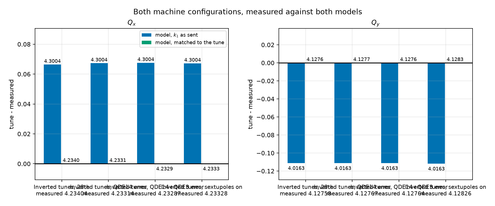
<figcaption>Each model's tune against the measured tune, every campaign on this page.</figcaption>
</figure>
<figure markdown>
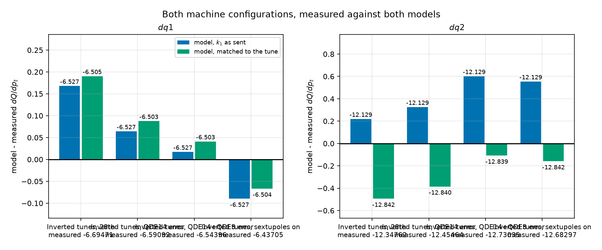
<figcaption>$dq1$ / $dq2$ model error against measurement, every campaign on this page.</figcaption>
</figure>
<figure markdown>
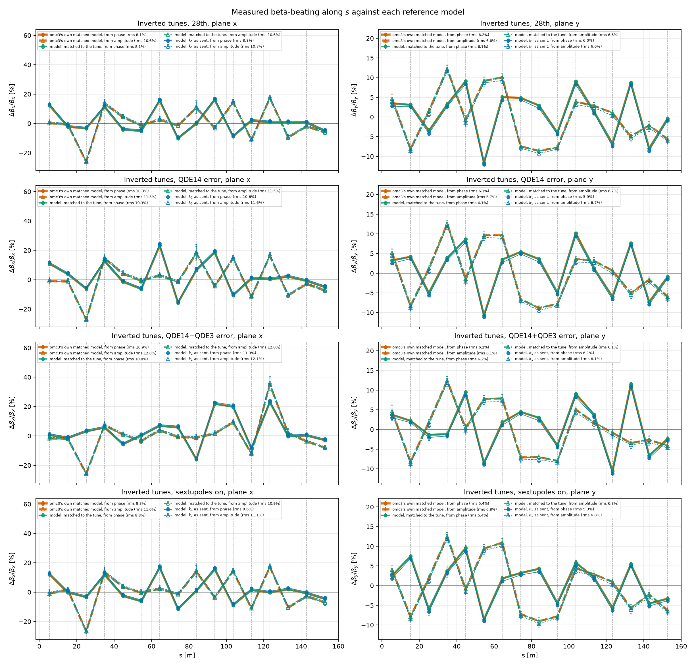
<figcaption>Measured beta-beating along $s$ against each reference model, from phase beta (filled) and from amplitude beta (open); each curve's rms is in the legend.</figcaption>
</figure>

## Measured against the model

=== "Inverted tunes, 28th, nominal"

    This tab's model is stood up on the currents the machine ran at, read from LSA and applied unchanged.

    Closed-orbit response scaling of this model's tune error, $\sin(\pi Q_\text{machine}) / \sin(\pi Q_\text{model})$: x **0.83x**, y **7.61x**.

    <figure markdown>
    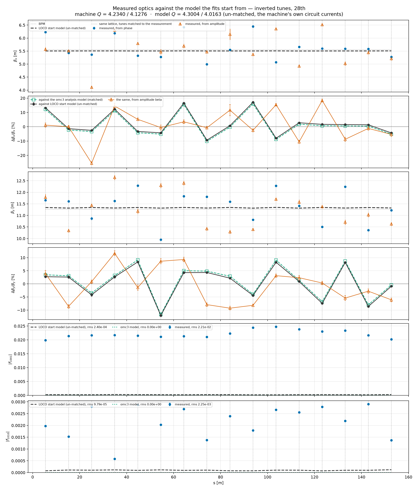
    <figcaption>Measured beta against this model, with the beating below each plane; the other model is drawn underneath for scale.</figcaption>
    </figure>

    BPM-to-BPM phase advance against the matched model, rms in units of $2\pi$: `0mm` x 0.0045, `0mm` y 0.0021.


=== "Inverted tunes, 28th, matched"

    This tab's model is stood up on those same currents, then `kbrqf` and `kbrqd` moved until it sits on the measured tune.

    QFO / QDE move -0.73 % / +0.46 % in magnitude to get there, to 0.734112 / -0.741176.

    Closed-orbit response scaling of this model's tune error, $\sin(\pi Q_\text{machine}) / \sin(\pi Q_\text{model})$: x **1.00x**, y **1.00x**.

    <figure markdown>
    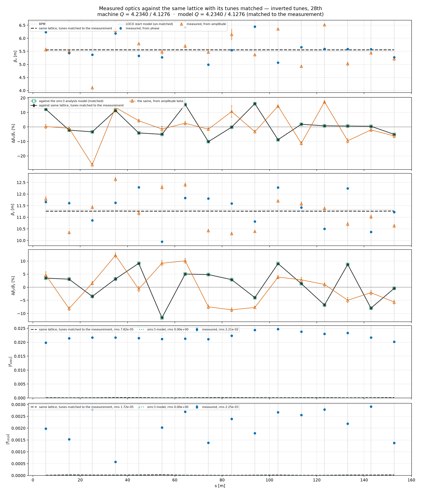
    <figcaption>Measured beta against this model, with the beating below each plane; the other model is drawn underneath for scale.</figcaption>
    </figure>

    BPM-to-BPM phase advance against the matched model, rms in units of $2\pi$: `0mm` x 0.0045, `0mm` y 0.0021.


=== "Inverted tunes, QDE14 error, nominal"

    This tab's model is stood up on the currents the machine ran at, read from LSA and applied unchanged.

    Closed-orbit response scaling of this model's tune error, $\sin(\pi Q_\text{machine}) / \sin(\pi Q_\text{model})$: x **0.83x**, y **7.61x**.

    <figure markdown>
    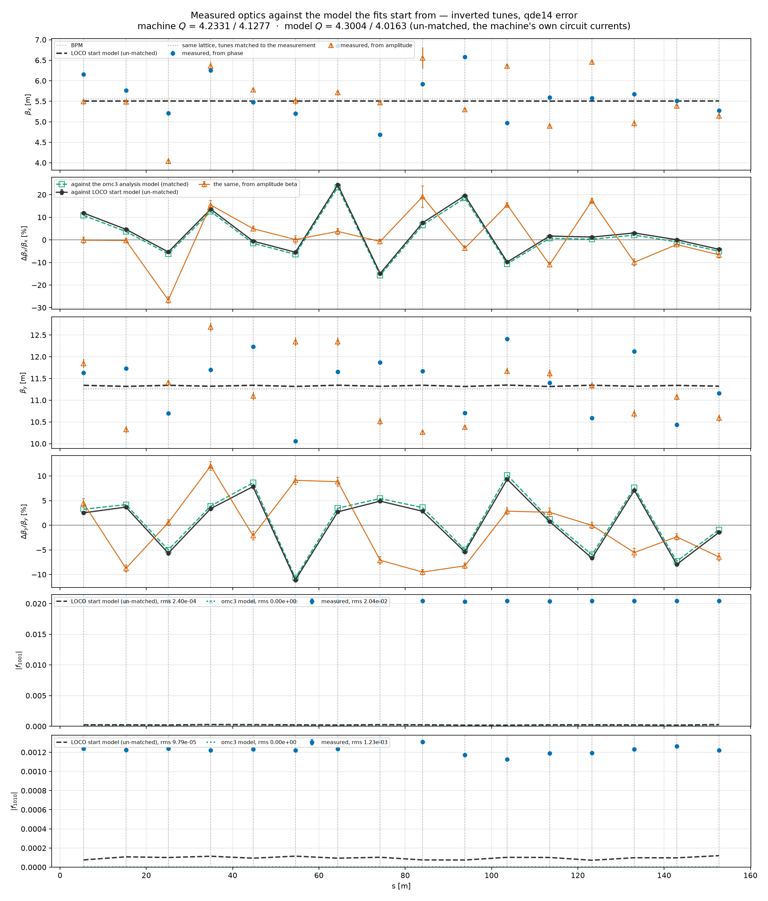
    <figcaption>Measured beta against this model, with the beating below each plane; the other model is drawn underneath for scale.</figcaption>
    </figure>

    BPM-to-BPM phase advance against the matched model, rms in units of $2\pi$: `0mm` x 0.0052, `0mm` y 0.0019.


=== "Inverted tunes, QDE14 error, matched"

    This tab's model is stood up on those same currents, then `kbrqf` and `kbrqd` moved until it sits on the measured tune.

    QFO / QDE move -0.75 % / +0.45 % in magnitude to get there, to 0.733986 / -0.741113.

    Closed-orbit response scaling of this model's tune error, $\sin(\pi Q_\text{machine}) / \sin(\pi Q_\text{model})$: x **1.00x**, y **1.00x**.

    <figure markdown>
    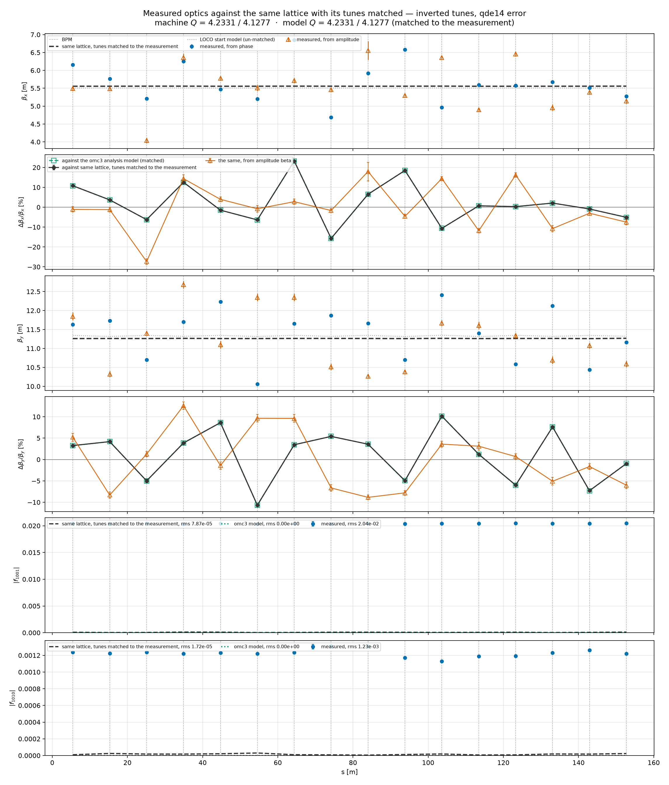
    <figcaption>Measured beta against this model, with the beating below each plane; the other model is drawn underneath for scale.</figcaption>
    </figure>

    BPM-to-BPM phase advance against the matched model, rms in units of $2\pi$: `0mm` x 0.0052, `0mm` y 0.0019.


=== "Inverted tunes, QDE14+QDE3 error, nominal"

    This tab's model is stood up on the currents the machine ran at, read from LSA and applied unchanged.

    Closed-orbit response scaling of this model's tune error, $\sin(\pi Q_\text{machine}) / \sin(\pi Q_\text{model})$: x **0.82x**, y **7.61x**.

    <figure markdown>
    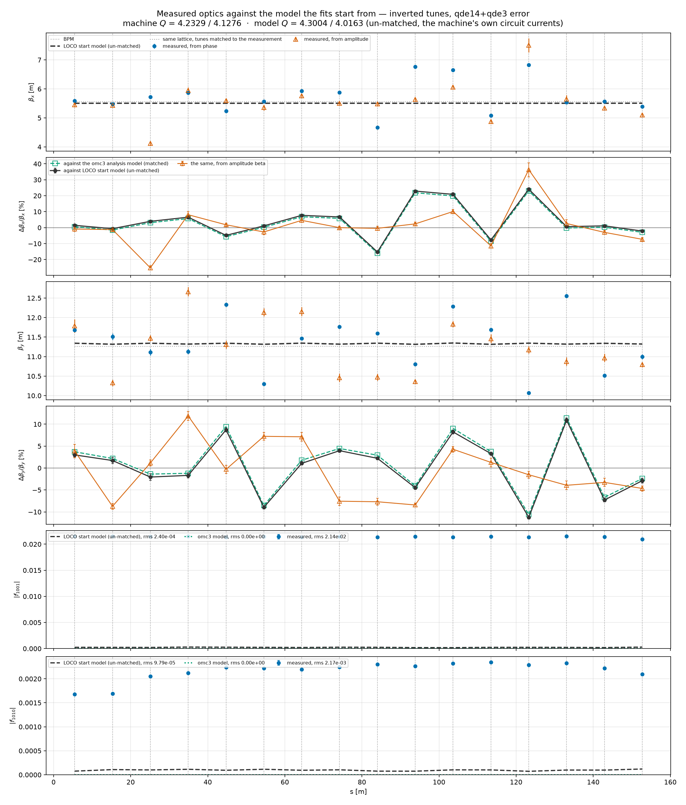
    <figcaption>Measured beta against this model, with the beating below each plane; the other model is drawn underneath for scale.</figcaption>
    </figure>

    BPM-to-BPM phase advance against the matched model, rms in units of $2\pi$: `m2mm` x 0.0052, `m2mm` y 0.0023.


=== "Inverted tunes, QDE14+QDE3 error, matched"

    This tab's model is stood up on those same currents, then `kbrqf` and `kbrqd` moved until it sits on the measured tune.

    QFO / QDE move -0.75 % / +0.45 % in magnitude to get there, to 0.733947 / -0.741091.

    Closed-orbit response scaling of this model's tune error, $\sin(\pi Q_\text{machine}) / \sin(\pi Q_\text{model})$: x **1.00x**, y **1.00x**.

    <figure markdown>
    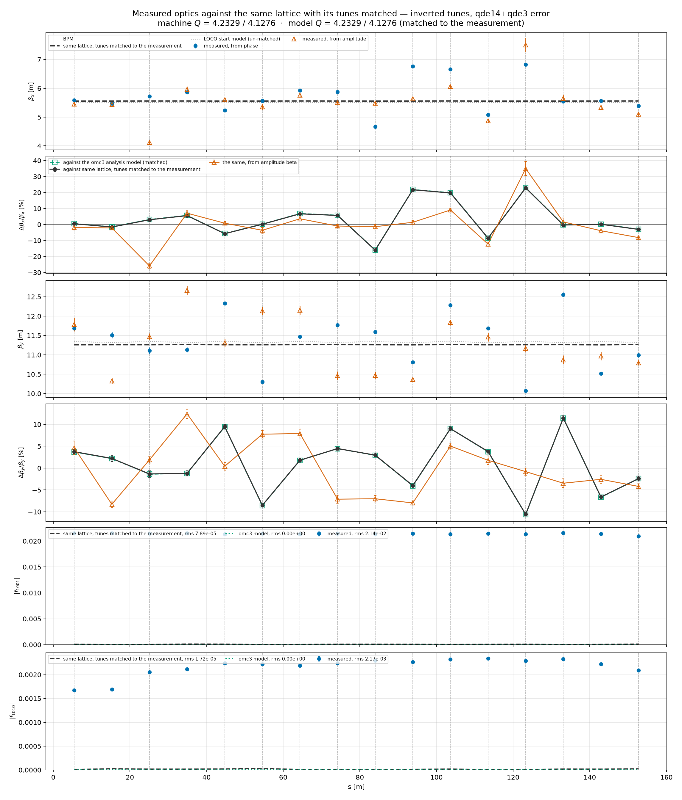
    <figcaption>Measured beta against this model, with the beating below each plane; the other model is drawn underneath for scale.</figcaption>
    </figure>

    BPM-to-BPM phase advance against the matched model, rms in units of $2\pi$: `m2mm` x 0.0052, `m2mm` y 0.0023.


=== "Inverted tunes, sextupoles on, nominal"

    This tab's model is stood up on the currents the machine ran at, read from LSA and applied unchanged.

    Closed-orbit response scaling of this model's tune error, $\sin(\pi Q_\text{machine}) / \sin(\pi Q_\text{model})$: x **0.83x**, y **7.64x**.

    <figure markdown>
    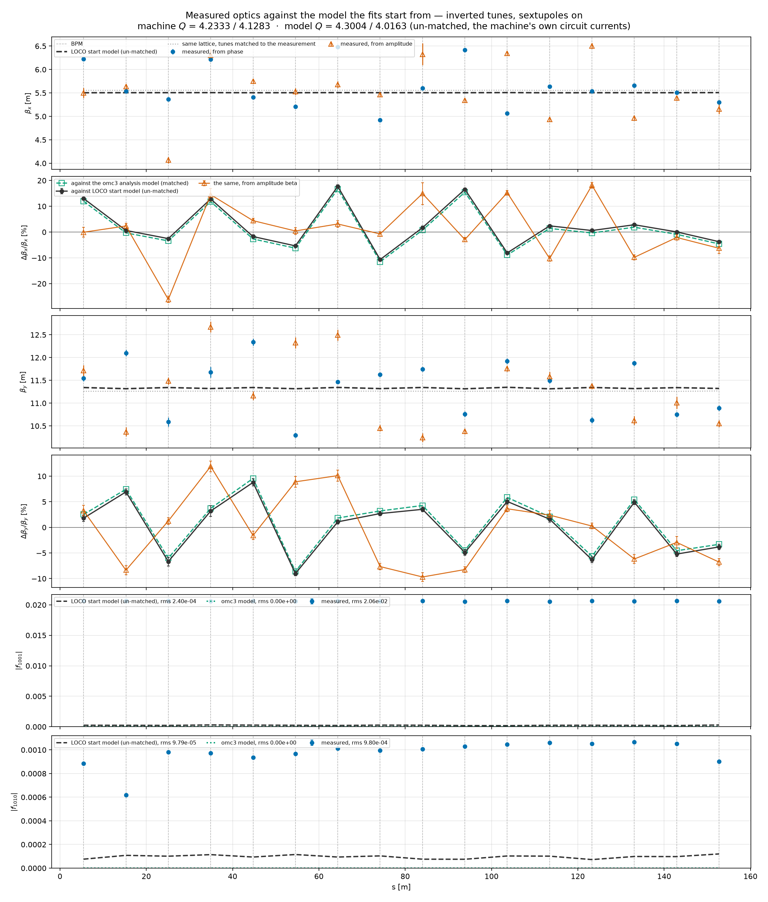
    <figcaption>Measured beta against this model, with the beating below each plane; the other model is drawn underneath for scale.</figcaption>
    </figure>

    BPM-to-BPM phase advance against the matched model, rms in units of $2\pi$: `0mm` x 0.0044, `0mm` y 0.0017.


=== "Inverted tunes, sextupoles on, matched"

    This tab's model is stood up on those same currents, then `kbrqf` and `kbrqd` moved until it sits on the measured tune.

    QFO / QDE move -0.74 % / +0.46 % in magnitude to get there, to 0.734027 / -0.741169.

    Closed-orbit response scaling of this model's tune error, $\sin(\pi Q_\text{machine}) / \sin(\pi Q_\text{model})$: x **1.00x**, y **1.00x**.

    <figure markdown>
    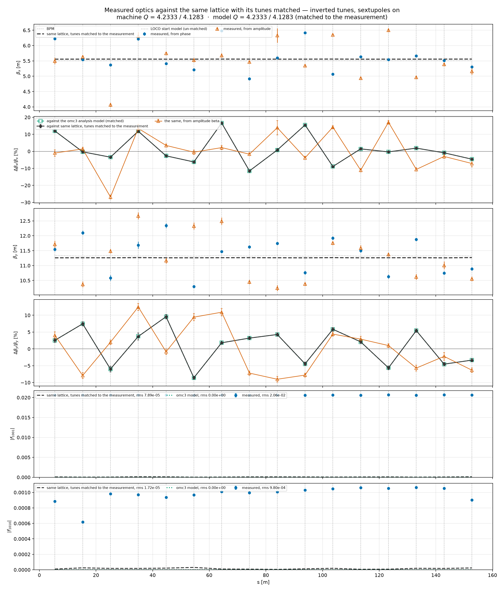
    <figcaption>Measured beta against this model, with the beating below each plane; the other model is drawn underneath for scale.</figcaption>
    </figure>

    BPM-to-BPM phase advance against the matched model, rms in units of $2\pi$: `0mm` x 0.0044, `0mm` y 0.0017.


---

## Rerunning this page

```bash
uv run python scripts/measured_optics.py --campaign inverted_second inverted_qde14_err inverted_qde14_qde3_err inverted_sexts_on
uv run python scripts/report_cases.py --campaign <slug>
uv run python reports/loco_option_matrix/make_pages.py
```
