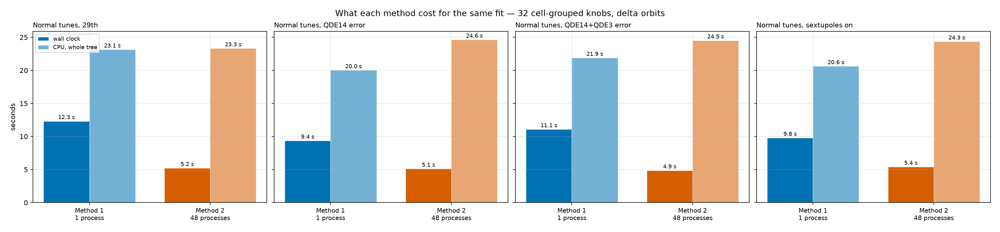
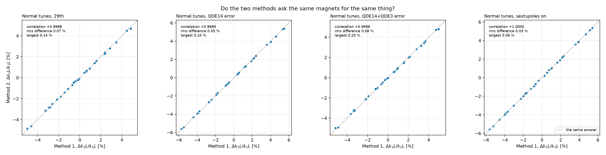

# Method 1 against Method 2

PSB ring 3 · both methods, same 32 cell-grouped knobs, same delta orbits. Wall clock is one run on one machine, not a mean over repeats; the CPU column is the whole process tree, which for Method 2 is one worker per corrector setting.

## The two runs

=== "Normal tunes, 29th"

    | method | wall [s] | CPU [s] | peak RSS [MB] | processes |
    |---|---|---|---|---|
    | Method 1 | 12.3 | 23.1 | 252 | 1 |
    | Method 2 | 5.2 | 23.3 | 269 | 48 |

=== "Normal tunes, QDE14 error"

    | method | wall [s] | CPU [s] | peak RSS [MB] | processes |
    |---|---|---|---|---|
    | Method 1 | 9.4 | 20.0 | 253 | 1 |
    | Method 2 | 5.1 | 24.6 | 268 | 48 |

=== "Normal tunes, QDE14+QDE3 error"

    | method | wall [s] | CPU [s] | peak RSS [MB] | processes |
    |---|---|---|---|---|
    | Method 1 | 11.1 | 21.9 | 258 | 1 |
    | Method 2 | 4.9 | 24.5 | 268 | 48 |

=== "Normal tunes, sextupoles on"

    | method | wall [s] | CPU [s] | peak RSS [MB] | processes |
    |---|---|---|---|---|
    | Method 1 | 9.8 | 20.6 | 265 | 1 |
    | Method 2 | 5.4 | 24.3 | 267 | 48 |

## Agreement

| configuration | magnets | correlation | rms difference [%] | max difference [%] |
|---|---|---|---|---|
| Normal tunes, 29th | 48 | +0.9998 | 0.07 | 0.14 |
| Normal tunes, QDE14 error | 48 | +0.9999 | 0.05 | 0.10 |
| Normal tunes, QDE14+QDE3 error | 48 | +0.9998 | 0.08 | 0.20 |
| Normal tunes, sextupoles on | 48 | +1.0000 | 0.03 | 0.06 |

## Speed and agreement

<figure markdown>

<figcaption>Wall clock and whole-tree CPU for each method, every benchmarked configuration.</figcaption>
</figure>

<figure markdown>

<figcaption>Each magnet's fitted gradient, Method 1 against Method 2.</figcaption>
</figure>
