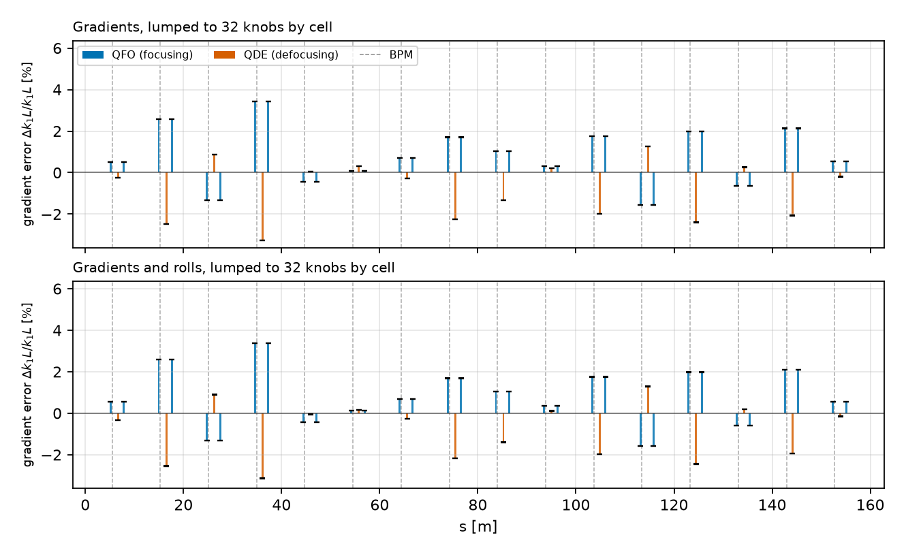
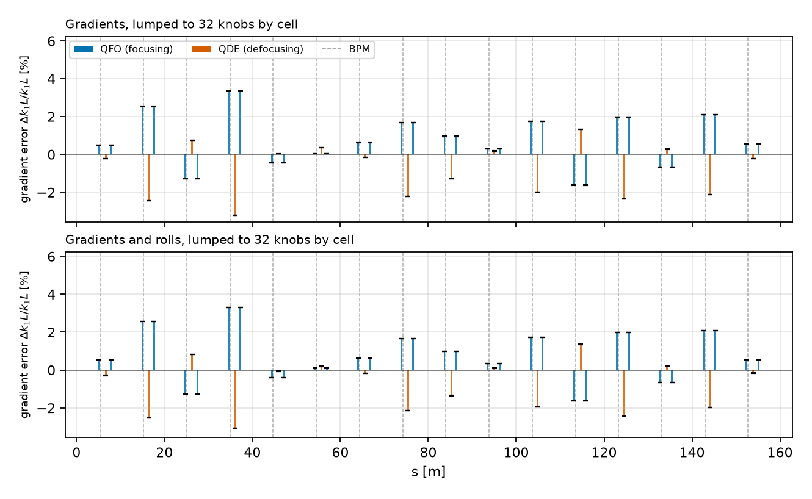
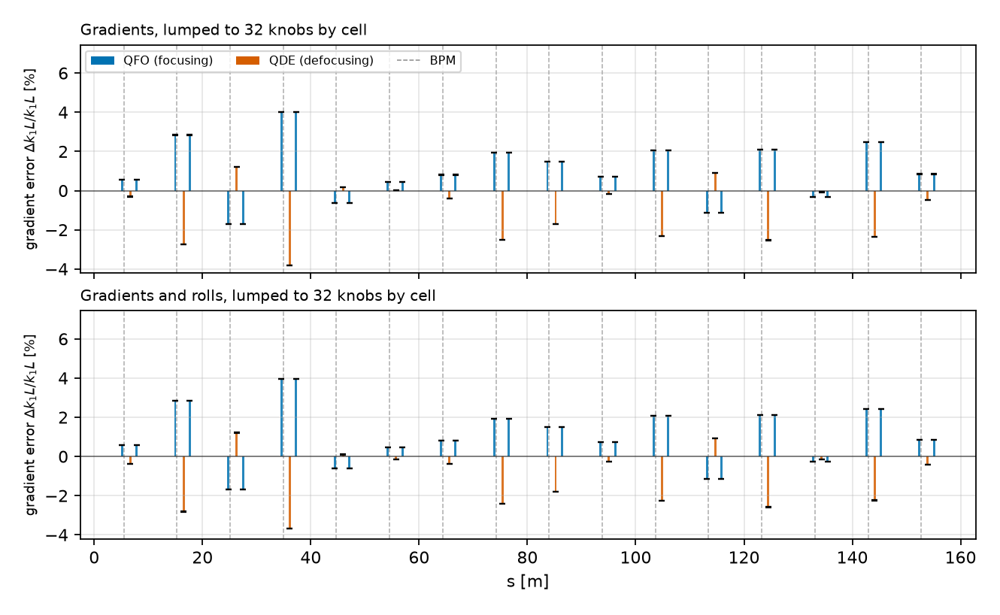

# Delta orbits

PSB ring 3 · multi momentum · both planes as delta orbits · 4 machine configurations as tabs.

## Fitted knobs, per family

=== "Normal tunes, 29th"

    | case | family | knobs | rms | max | median $\sigma$ | median $\lvert v\rvert/\sigma$ | above 1 |
    |---|---|---|---|---|---|---|---|
    | Gradients, lumped to 32 knobs by cell | gradients \[% of nominal $k_1L$] | 32 of 48 | 1.73 | 3.84 | 0.00 | 448.48 | 48 of 48 |
    | Gradients and rolls, lumped to 32 knobs by cell | gradients \[% of nominal $k_1L$] | 32 of 48 | 1.72 | 3.79 | 0.00 | 447.91 | 48 of 48 |
    |  | rolls \[mrad] | 32 of 48 | 2.98 | 4.85 | 0.08 | 27.09 | 48 of 48 |

=== "Normal tunes, QDE14 error"

    | case | family | knobs | rms | max | median $\sigma$ | median $\lvert v\rvert/\sigma$ | above 1 |
    |---|---|---|---|---|---|---|---|
    | Gradients, lumped to 32 knobs by cell | gradients \[% of nominal $k_1L$] | 32 of 48 | 1.58 | 3.43 | 0.00 | 406.21 | 48 of 48 |
    | Gradients and rolls, lumped to 32 knobs by cell | gradients \[% of nominal $k_1L$] | 32 of 48 | 1.57 | 3.39 | 0.00 | 394.66 | 48 of 48 |
    |  | rolls \[mrad] | 32 of 48 | 3.09 | 5.08 | 0.09 | 28.65 | 48 of 48 |

=== "Normal tunes, QDE14+QDE3 error"

    | case | family | knobs | rms | max | median $\sigma$ | median $\lvert v\rvert/\sigma$ | above 1 |
    |---|---|---|---|---|---|---|---|
    | Gradients, lumped to 32 knobs by cell | gradients \[% of nominal $k_1L$] | 32 of 48 | 1.56 | 3.36 | 0.00 | 429.17 | 48 of 48 |
    | Gradients and rolls, lumped to 32 knobs by cell | gradients \[% of nominal $k_1L$] | 32 of 48 | 1.55 | 3.31 | 0.00 | 411.75 | 48 of 48 |
    |  | rolls \[mrad] | 32 of 48 | 3.16 | 5.13 | 0.09 | 31.54 | 48 of 48 |

=== "Normal tunes, sextupoles on"

    | case | family | knobs | rms | max | median $\sigma$ | median $\lvert v\rvert/\sigma$ | above 1 |
    |---|---|---|---|---|---|---|---|
    | Gradients, lumped to 32 knobs by cell | gradients \[% of nominal $k_1L$] | 32 of 48 | 1.80 | 4.02 | 0.00 | 457.31 | 48 of 48 |
    | Gradients and rolls, lumped to 32 knobs by cell | gradients \[% of nominal $k_1L$] | 32 of 48 | 1.79 | 3.97 | 0.00 | 457.47 | 48 of 48 |
    |  | rolls \[mrad] | 32 of 48 | 3.09 | 5.25 | 0.08 | 24.45 | 48 of 48 |

## Fitted knobs

=== "Normal tunes, 29th"

    <figure markdown>
    
    <figcaption>Fitted gradient error per magnet, one panel per case.</figcaption>
    </figure>

    <figure markdown>
    
    <figcaption>The same gradients as |value| / sigma, log scale.</figcaption>
    </figure>

    <figure markdown>
    
    <figcaption>Fitted quadrupole roll per magnet, where rolls were free.</figcaption>
    </figure>

    <figure markdown>
    
    <figcaption>The same rolls as |value| / sigma, log scale.</figcaption>
    </figure>

=== "Normal tunes, QDE14 error"

    <figure markdown>
    
    <figcaption>Fitted gradient error per magnet, one panel per case.</figcaption>
    </figure>

    <figure markdown>
    
    <figcaption>The same gradients as |value| / sigma, log scale.</figcaption>
    </figure>

    <figure markdown>
    
    <figcaption>Fitted quadrupole roll per magnet, where rolls were free.</figcaption>
    </figure>

    <figure markdown>
    
    <figcaption>The same rolls as |value| / sigma, log scale.</figcaption>
    </figure>

=== "Normal tunes, QDE14+QDE3 error"

    <figure markdown>
    
    <figcaption>Fitted gradient error per magnet, one panel per case.</figcaption>
    </figure>

    <figure markdown>
    
    <figcaption>The same gradients as |value| / sigma, log scale.</figcaption>
    </figure>

    <figure markdown>
    
    <figcaption>Fitted quadrupole roll per magnet, where rolls were free.</figcaption>
    </figure>

    <figure markdown>
    
    <figcaption>The same rolls as |value| / sigma, log scale.</figcaption>
    </figure>

=== "Normal tunes, sextupoles on"

    <figure markdown>
    
    <figcaption>Fitted gradient error per magnet, one panel per case.</figcaption>
    </figure>

    <figure markdown>
    
    <figcaption>The same gradients as |value| / sigma, log scale.</figcaption>
    </figure>

    <figure markdown>
    
    <figcaption>Fitted quadrupole roll per magnet, where rolls were free.</figcaption>
    </figure>

    <figure markdown>
    
    <figcaption>The same rolls as |value| / sigma, log scale.</figcaption>
    </figure>

## Fitted lattice, against the tune-matched model

=== "Normal tunes, 29th"

    <figure markdown>
    
    <figcaption>Beta-beating against the tune-matched model, with the measured points; the machine-knob model is the dotted curve.</figcaption>
    </figure>

    <figure markdown>
    
    <figcaption>Phase error, referred to the lattice matched to the measured tune.</figcaption>
    </figure>

    <figure markdown>
    
    <figcaption>Phase advance between adjacent BPMs, computed from each fitted lattice, the matched model and the measured points.</figcaption>
    </figure>

    <figure markdown>
    
    <figcaption>Dispersion, referred to the lattice matched to the measured tune.</figcaption>
    </figure>

    <figure markdown>
    
    <figcaption>Coupling amplitudes, referred to the tune-matched lattice.</figcaption>
    </figure>

=== "Normal tunes, QDE14 error"

    <figure markdown>
    
    <figcaption>Beta-beating against the tune-matched model, with the measured points; the machine-knob model is the dotted curve.</figcaption>
    </figure>

    <figure markdown>
    
    <figcaption>Phase error, referred to the lattice matched to the measured tune.</figcaption>
    </figure>

    <figure markdown>
    
    <figcaption>Phase advance between adjacent BPMs, computed from each fitted lattice, the matched model and the measured points.</figcaption>
    </figure>

    <figure markdown>
    
    <figcaption>Dispersion, referred to the lattice matched to the measured tune.</figcaption>
    </figure>

    <figure markdown>
    
    <figcaption>Coupling amplitudes, referred to the tune-matched lattice.</figcaption>
    </figure>

=== "Normal tunes, QDE14+QDE3 error"

    <figure markdown>
    
    <figcaption>Beta-beating against the tune-matched model, with the measured points; the machine-knob model is the dotted curve.</figcaption>
    </figure>

    <figure markdown>
    
    <figcaption>Phase error, referred to the lattice matched to the measured tune.</figcaption>
    </figure>

    <figure markdown>
    
    <figcaption>Phase advance between adjacent BPMs, computed from each fitted lattice, the matched model and the measured points.</figcaption>
    </figure>

    <figure markdown>
    
    <figcaption>Dispersion, referred to the lattice matched to the measured tune.</figcaption>
    </figure>

    <figure markdown>
    
    <figcaption>Coupling amplitudes, referred to the tune-matched lattice.</figcaption>
    </figure>

=== "Normal tunes, sextupoles on"

    <figure markdown>
    
    <figcaption>Beta-beating against the tune-matched model, with the measured points; the machine-knob model is the dotted curve.</figcaption>
    </figure>

    <figure markdown>
    
    <figcaption>Phase error, referred to the lattice matched to the measured tune.</figcaption>
    </figure>

    <figure markdown>
    
    <figcaption>Phase advance between adjacent BPMs, computed from each fitted lattice, the matched model and the measured points.</figcaption>
    </figure>

    <figure markdown>
    
    <figcaption>Dispersion, referred to the lattice matched to the measured tune.</figcaption>
    </figure>

    <figure markdown>
    
    <figcaption>Coupling amplitudes, referred to the tune-matched lattice.</figcaption>
    </figure>

## Tune and chromaticity

=== "Normal tunes, 29th"

    <figure markdown>
    
    <figcaption>Fitted tune per case against the measured tune, bar length is the error.</figcaption>
    </figure>

    <figure markdown>
    
    <figcaption>Fitted Q'H and Q'V against the measurement, under both Dp/p calibrations.</figcaption>
    </figure>

=== "Normal tunes, QDE14 error"

    <figure markdown>
    
    <figcaption>Fitted tune per case against the measured tune, bar length is the error.</figcaption>
    </figure>

    <figure markdown>
    
    <figcaption>Fitted Q'H and Q'V against the measurement, under both Dp/p calibrations.</figcaption>
    </figure>

=== "Normal tunes, QDE14+QDE3 error"

    <figure markdown>
    
    <figcaption>Fitted tune per case against the measured tune, bar length is the error.</figcaption>
    </figure>

    <figure markdown>
    
    <figcaption>Fitted Q'H and Q'V against the measurement, under both Dp/p calibrations.</figcaption>
    </figure>

=== "Normal tunes, sextupoles on"

    <figure markdown>
    
    <figcaption>Fitted tune per case against the measured tune, bar length is the error.</figcaption>
    </figure>

    <figure markdown>
    
    <figcaption>Fitted Q'H and Q'V against the measurement, under both Dp/p calibrations.</figcaption>
    </figure>

## Residuals

=== "Normal tunes, 29th"

    <figure markdown>
    
    <figcaption>Delta-orbit residual rms per BPM, measured minus model.</figcaption>
    </figure>

    <figure markdown>
    
    <figcaption>Closed-orbit residual rms per BPM, measured minus model.</figcaption>
    </figure>

    <figure markdown>
    
    <figcaption>Residual rms per scored measurement, as a percentage of the measured amplitude, log scale.</figcaption>
    </figure>

=== "Normal tunes, QDE14 error"

    <figure markdown>
    
    <figcaption>Delta-orbit residual rms per BPM, measured minus model.</figcaption>
    </figure>

    <figure markdown>
    
    <figcaption>Closed-orbit residual rms per BPM, measured minus model.</figcaption>
    </figure>

    <figure markdown>
    
    <figcaption>Residual rms per scored measurement, as a percentage of the measured amplitude, log scale.</figcaption>
    </figure>

=== "Normal tunes, QDE14+QDE3 error"

    <figure markdown>
    
    <figcaption>Delta-orbit residual rms per BPM, measured minus model.</figcaption>
    </figure>

    <figure markdown>
    
    <figcaption>Closed-orbit residual rms per BPM, measured minus model.</figcaption>
    </figure>

    <figure markdown>
    
    <figcaption>Residual rms per scored measurement, as a percentage of the measured amplitude, log scale.</figcaption>
    </figure>

=== "Normal tunes, sextupoles on"

    <figure markdown>
    
    <figcaption>Delta-orbit residual rms per BPM, measured minus model.</figcaption>
    </figure>

    <figure markdown>
    
    <figcaption>Closed-orbit residual rms per BPM, measured minus model.</figcaption>
    </figure>

    <figure markdown>
    
    <figcaption>Residual rms per scored measurement, as a percentage of the measured amplitude, log scale.</figcaption>
    </figure>
