# One knob per magnet — single momentum

PSB ring 3 · method 2 · single momentum · 2026-08-21 corrector scans · both planes as delta orbits · [method](../method.md)

**Single momentum fit.** 12 correctors, 4 non-zero `dkick` values (±0.75, ±1.5), nominal RF (`dpt = 0`). Absolute options also fit the averaged static orbit. Non-zero-RF residuals are held-out validation.

## Machine and start models

=== "Normal tunes, 29th"

    |  | measured | model, $k_1$ as sent | model, matched to the tune |
    |---|---|---|---|
    | QFO / QDE, MAD $k_1$ | 0.728900 / -0.744277, from LSA | the same | 0.729196 / -0.744329 (+0.04 % / +0.01 %) |
    | beta-beating from phase, x | — | 6.6 % rms, 11.6 % peak | 6.6 % rms, 11.7 % peak |
    | beta-beating from phase, y | — | 5.8 % rms, 10.9 % peak | 5.8 % rms, 10.9 % peak |
    | beta-beating from amplitude, x | — | 9.5 % rms, 27.6 % peak | 9.5 % rms, 27.5 % peak |
    | beta-beating from amplitude, y | — | 5.7 % rms, 11.3 % peak | 5.7 % rms, 11.3 % peak |
    | AC-dipole drive, 0mm | 0.169601 / 0.232495 (set 0.1696 / 0.2325) | — | — |
    | AC-dipole drive, m2mm | 0.173801 / 0.240995 (set 0.1738 / 0.2410) | — | — |
    | AC-dipole drive, 2mm | 0.165201 / 0.224596 (set 0.1652 / 0.2246) | — | — |
    | measurement variation / fit error | tune 3.5e-05 / 1.4e-04, $dq1/dq2$ fit $1\sigma$ 0.032 / 0.073 | — | — |

=== "Normal tunes, QDE14 error"

    |  | measured | model, $k_1$ as sent | model, matched to the tune |
    |---|---|---|---|
    | QFO / QDE, MAD $k_1$ | 0.728900 / -0.744277, from LSA | the same | 0.729230 / -0.744382 (+0.05 % / +0.01 %) |
    | beta-beating from phase, x | — | 11.1 % rms, 27.2 % peak | 11.1 % rms, 27.2 % peak |
    | beta-beating from phase, y | — | 5.9 % rms, 11.4 % peak | 5.9 % rms, 11.4 % peak |
    | beta-beating from amplitude, x | — | 10.3 % rms, 29.2 % peak | 10.3 % rms, 29.3 % peak |
    | beta-beating from amplitude, y | — | 5.9 % rms, 11.8 % peak | 5.9 % rms, 11.8 % peak |
    | AC-dipole drive, 0mm | 0.169301 / 0.232696 (set 0.1693 / 0.2327) | — | — |
    | AC-dipole drive, m2mm | 0.173601 / 0.241296 (set 0.1736 / 0.2413) | — | — |
    | AC-dipole drive, 2mm | 0.165201 / 0.224294 (set 0.1652 / 0.2243) | — | — |
    | measurement variation / fit error | tune 5.5e-05 / 1.2e-04, $dq1/dq2$ fit $1\sigma$ 0.030 / 0.068 | — | — |

=== "Normal tunes, QDE14+QDE3 error"

    |  | measured | model, $k_1$ as sent | model, matched to the tune |
    |---|---|---|---|
    | QFO / QDE, MAD $k_1$ | 0.728900 / -0.744277, from LSA | the same | 0.729203 / -0.744309 (+0.04 % / +0.00 %) |
    | beta-beating from phase, x | — | 10.0 % rms, 22.7 % peak | 10.0 % rms, 22.7 % peak |
    | beta-beating from phase, y | — | 6.2 % rms, 11.8 % peak | 6.2 % rms, 11.7 % peak |
    | beta-beating from amplitude, x | — | 10.3 % rms, 27.6 % peak | 10.3 % rms, 27.6 % peak |
    | beta-beating from amplitude, y | — | 5.6 % rms, 11.3 % peak | 5.6 % rms, 11.3 % peak |
    | AC-dipole drive, 0mm | 0.169601 / 0.232395 (set 0.1696 / 0.2324) | — | — |
    | AC-dipole drive, m2mm | 0.174001 / 0.240795 (set 0.1740 / 0.2408) | — | — |
    | AC-dipole drive, 2mm | 0.165401 / 0.224196 (set 0.1654 / 0.2242) | — | — |
    | measurement variation / fit error | tune 4.6e-05 / 2.5e-04, $dq1/dq2$ fit $1\sigma$ 0.034 / 0.077 | — | — |

=== "Normal tunes, sextupoles on"

    |  | measured | model, $k_1$ as sent | model, matched to the tune |
    |---|---|---|---|
    | QFO / QDE, MAD $k_1$ | 0.728900 / -0.744277, from LSA | the same | 0.729281 / -0.744381 (+0.05 % / +0.01 %) |
    | beta-beating from phase, x | — | 6.4 % rms, 11.5 % peak | 6.4 % rms, 11.6 % peak |
    | beta-beating from phase, y | — | 5.4 % rms, 10.5 % peak | 5.4 % rms, 10.5 % peak |
    | beta-beating from amplitude, x | — | 9.5 % rms, 27.3 % peak | 9.5 % rms, 27.3 % peak |
    | beta-beating from amplitude, y | — | 5.6 % rms, 11.0 % peak | 5.5 % rms, 11.0 % peak |
    | AC-dipole drive, 0mm | 0.169801 / 0.232496 (set 0.1698 / 0.2325) | — | — |
    | AC-dipole drive, m2mm | 0.174401 / 0.240395 (set 0.1744 / 0.2404) | — | — |
    | AC-dipole drive, 2mm | 0.165401 / 0.224295 (set 0.1654 / 0.2243) | — | — |
    | measurement variation / fit error | tune 9.2e-05 / 2.8e-04, $dq1/dq2$ fit $1\sigma$ 0.030 / 0.070 | — | — |

## Fitted knobs

=== "Normal tunes, 29th"

    | case | family | knobs | rms | max | median $\sigma$ | median $\lvert v\rvert/\sigma$ | above 1 |
    |---|---|---|---|---|---|---|---|
    | Gradients, one knob per magnet, delta orbits | gradients \[% of nominal $k_1L$] | 48 of 48 | 8.12 | 22.86 | 0.06 | 106.11 | 47 of 48 |
    | Gradients, bends and offsets, one knob per magnet, absolute orbits | gradients \[% of nominal $k_1L$] | 48 of 48 | 2.68 | 8.16 | 4.66 | 0.44 | 11 of 48 |
    |  | bends \[% of nominal bend angle] | 32 of 32 | 0.12 | 0.36 | 0.03 | 2.51 | 23 of 32 |
    |  | offsets \[mm] | 48 of 48 | 0.13 | 0.54 | 0.19 | 0.35 | 12 of 48 |

=== "Normal tunes, QDE14 error"

    | case | family | knobs | rms | max | median $\sigma$ | median $\lvert v\rvert/\sigma$ | above 1 |
    |---|---|---|---|---|---|---|---|
    | Gradients, one knob per magnet, delta orbits | gradients \[% of nominal $k_1L$] | 48 of 48 | 9.59 | 25.50 | 0.06 | 124.87 | 48 of 48 |
    | Gradients, bends and offsets, one knob per magnet, absolute orbits | gradients \[% of nominal $k_1L$] | 48 of 48 | 3.02 | 7.76 | 4.60 | 0.53 | 15 of 48 |
    |  | bends \[% of nominal bend angle] | 32 of 32 | 0.12 | 0.36 | 0.03 | 2.49 | 23 of 32 |
    |  | offsets \[mm] | 48 of 48 | 0.13 | 0.54 | 0.19 | 0.35 | 11 of 48 |

=== "Normal tunes, QDE14+QDE3 error"

    | case | family | knobs | rms | max | median $\sigma$ | median $\lvert v\rvert/\sigma$ | above 1 |
    |---|---|---|---|---|---|---|---|
    | Gradients, one knob per magnet, delta orbits | gradients \[% of nominal $k_1L$] | 48 of 48 | 7.79 | 23.01 | 0.06 | 102.78 | 47 of 48 |
    | Gradients, bends and offsets, one knob per magnet, absolute orbits | gradients \[% of nominal $k_1L$] | 48 of 48 | 2.85 | 8.03 | 4.64 | 0.44 | 13 of 48 |
    |  | bends \[% of nominal bend angle] | 32 of 32 | 0.12 | 0.36 | 0.03 | 2.50 | 23 of 32 |
    |  | offsets \[mm] | 48 of 48 | 0.13 | 0.54 | 0.19 | 0.35 | 11 of 48 |

=== "Normal tunes, sextupoles on"

    | case | family | knobs | rms | max | median $\sigma$ | median $\lvert v\rvert/\sigma$ | above 1 |
    |---|---|---|---|---|---|---|---|
    | Gradients, one knob per magnet, delta orbits | gradients \[% of nominal $k_1L$] | 48 of 48 | 9.64 | 26.65 | 0.06 | 126.40 | 48 of 48 |
    | Gradients, bends and offsets, one knob per magnet, absolute orbits | gradients \[% of nominal $k_1L$] | 48 of 48 | 3.04 | 7.92 | 4.62 | 0.55 | 14 of 48 |
    |  | bends \[% of nominal bend angle] | 32 of 32 | 0.12 | 0.36 | 0.03 | 2.50 | 23 of 32 |
    |  | offsets \[mm] | 48 of 48 | 0.13 | 0.54 | 0.19 | 0.34 | 11 of 48 |

### Gradients

=== "Normal tunes, 29th"

    <figure markdown>
    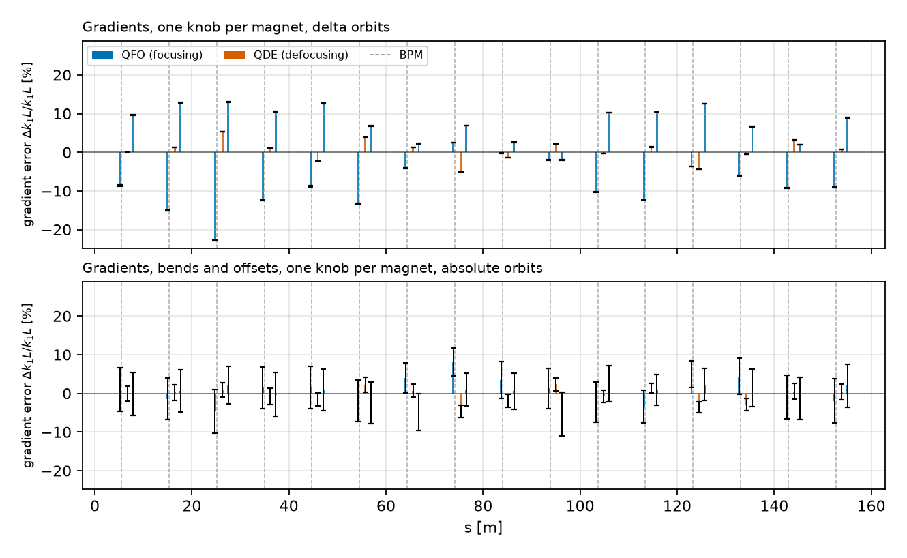
    <figcaption>Fitted gradient error per magnet, one panel per case.</figcaption>
    </figure>

    <figure markdown>
    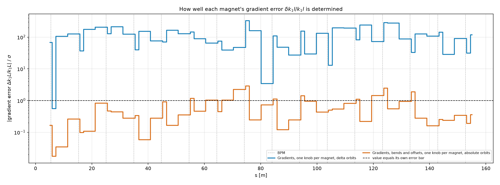
    <figcaption>The same gradients as |value| / σ.</figcaption>
    </figure>

=== "Normal tunes, QDE14 error"

    <figure markdown>
    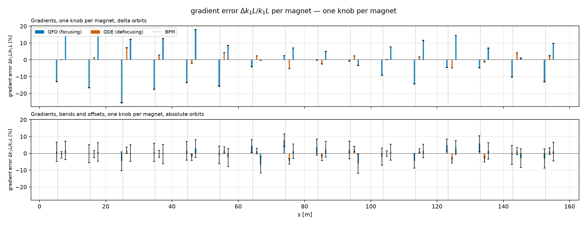
    <figcaption>Fitted gradient error per magnet, one panel per case.</figcaption>
    </figure>

    <figure markdown>
    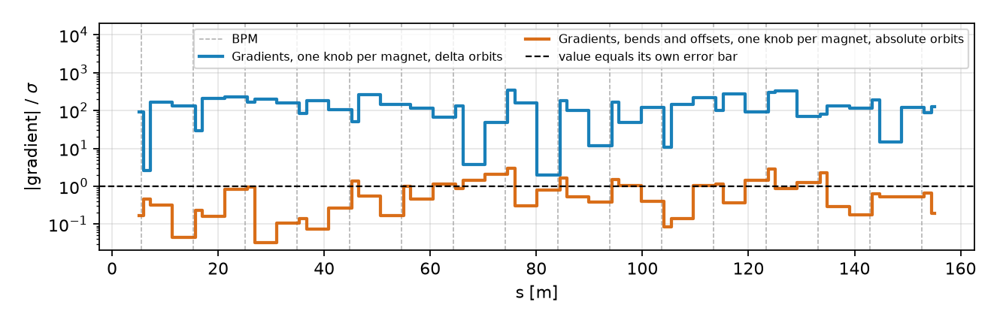
    <figcaption>The same gradients as |value| / σ.</figcaption>
    </figure>

=== "Normal tunes, QDE14+QDE3 error"

    <figure markdown>
    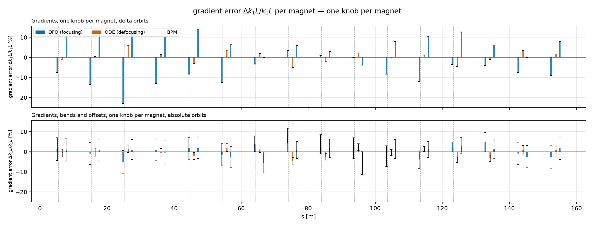
    <figcaption>Fitted gradient error per magnet, one panel per case.</figcaption>
    </figure>

    <figure markdown>
    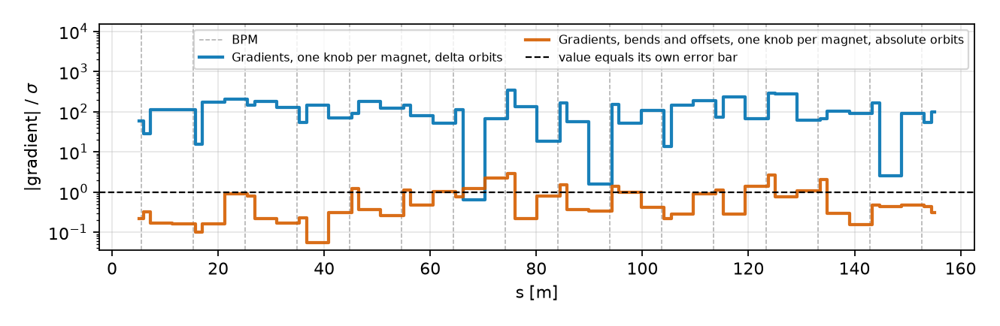
    <figcaption>The same gradients as |value| / σ.</figcaption>
    </figure>

=== "Normal tunes, sextupoles on"

    <figure markdown>
    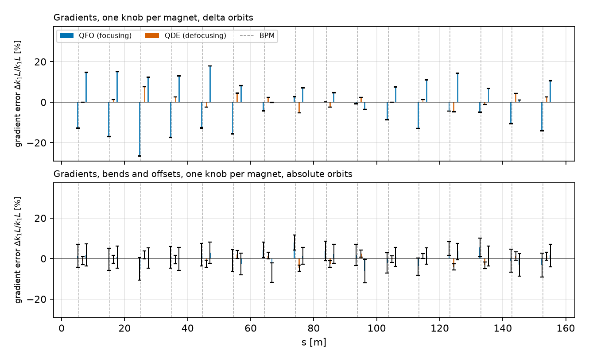
    <figcaption>Fitted gradient error per magnet, one panel per case.</figcaption>
    </figure>

    <figure markdown>
    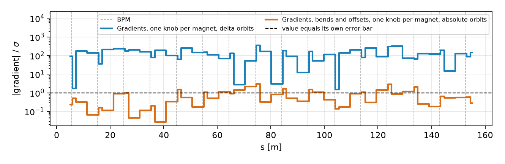
    <figcaption>The same gradients as |value| / σ.</figcaption>
    </figure>

### Bends

=== "Normal tunes, 29th"

    <figure markdown>
    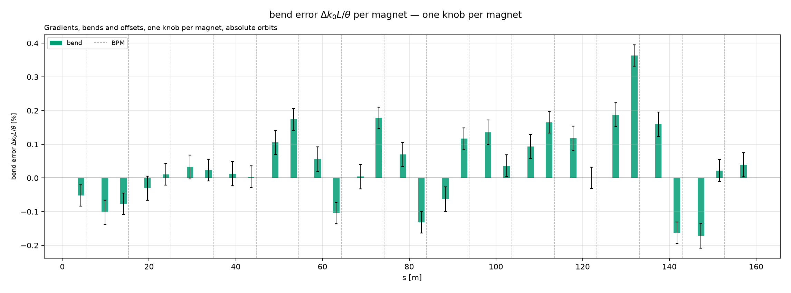
    <figcaption>Fitted bends per magnet, one panel per case.</figcaption>
    </figure>

=== "Normal tunes, QDE14 error"

    <figure markdown>
    
    <figcaption>Fitted bends per magnet, one panel per case.</figcaption>
    </figure>

=== "Normal tunes, QDE14+QDE3 error"

    <figure markdown>
    
    <figcaption>Fitted bends per magnet, one panel per case.</figcaption>
    </figure>

=== "Normal tunes, sextupoles on"

    <figure markdown>
    
    <figcaption>Fitted bends per magnet, one panel per case.</figcaption>
    </figure>

### Quadrupole offsets

=== "Normal tunes, 29th"

    <figure markdown>
    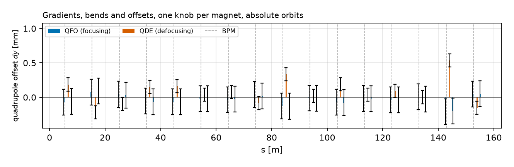
    <figcaption>Fitted quadrupole offsets per magnet, one panel per case.</figcaption>
    </figure>

=== "Normal tunes, QDE14 error"

    <figure markdown>
    
    <figcaption>Fitted quadrupole offsets per magnet, one panel per case.</figcaption>
    </figure>

=== "Normal tunes, QDE14+QDE3 error"

    <figure markdown>
    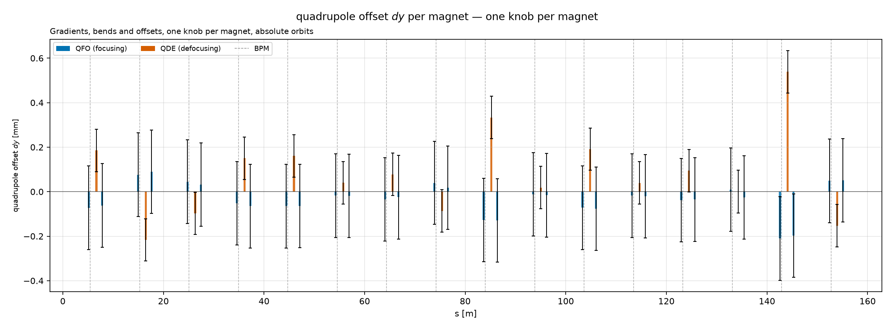
    <figcaption>Fitted quadrupole offsets per magnet, one panel per case.</figcaption>
    </figure>

=== "Normal tunes, sextupoles on"

    <figure markdown>
    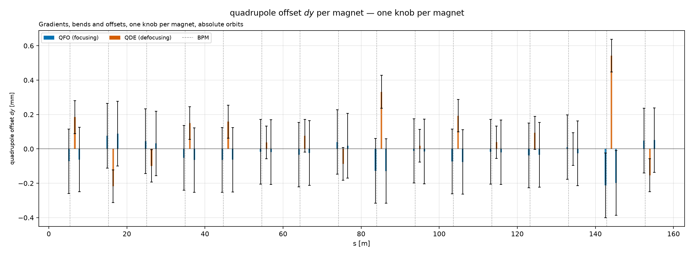
    <figcaption>Fitted quadrupole offsets per magnet, one panel per case.</figcaption>
    </figure>

## Fitted lattice

=== "Normal tunes, 29th, nominal"

    <figure markdown>
    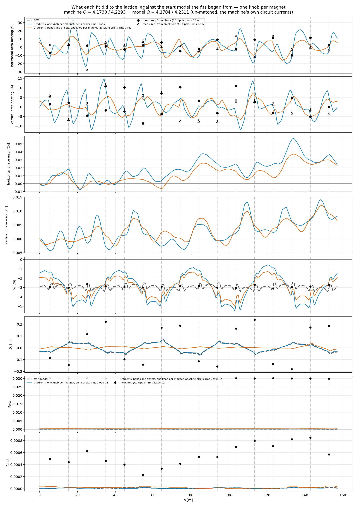
    <figcaption>Beta-beating, phase error and dispersion along s, per case, with the measured beta-beating at the BPMs taken against the model on the $k_1$ sent to the magnets.</figcaption>
    </figure>

=== "Normal tunes, 29th, matched"

    <figure markdown>
    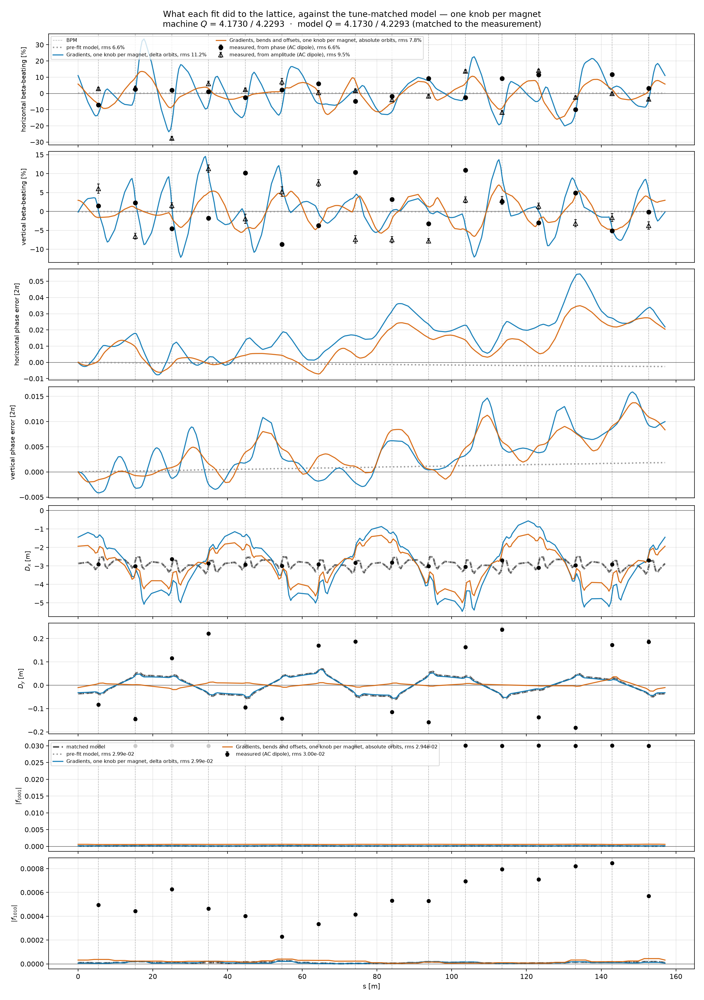
    <figcaption>Beta-beating, phase error and dispersion along s, per case, with the measured beta-beating at the BPMs taken against the model matched to the measured tune.</figcaption>
    </figure>

=== "Normal tunes, QDE14 error, nominal"

    <figure markdown>
    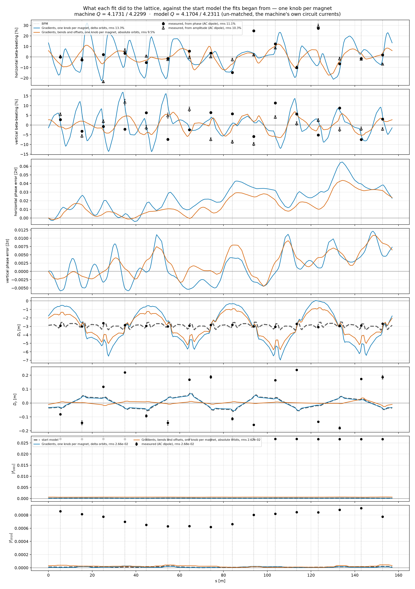
    <figcaption>Beta-beating, phase error and dispersion along s, per case, with the measured beta-beating at the BPMs taken against the model on the $k_1$ sent to the magnets.</figcaption>
    </figure>

=== "Normal tunes, QDE14 error, matched"

    <figure markdown>
    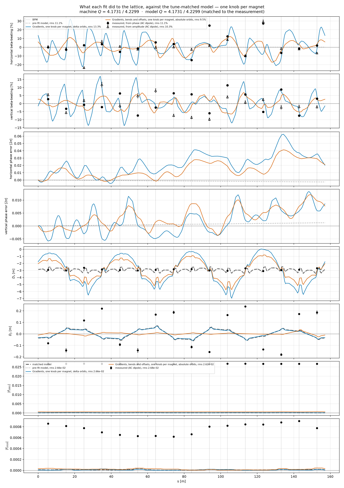
    <figcaption>Beta-beating, phase error and dispersion along s, per case, with the measured beta-beating at the BPMs taken against the model matched to the measured tune.</figcaption>
    </figure>

=== "Normal tunes, QDE14+QDE3 error, nominal"

    <figure markdown>
    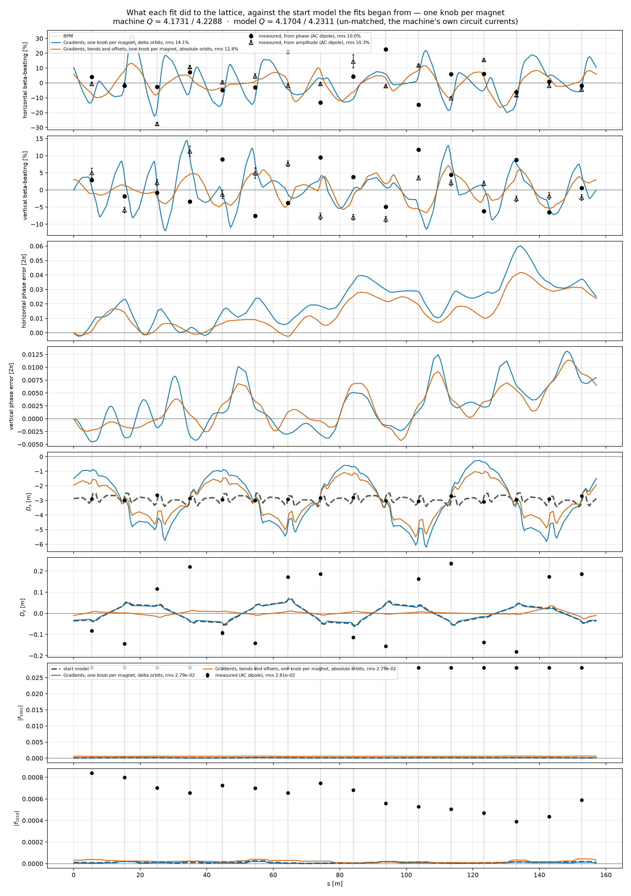
    <figcaption>Beta-beating, phase error and dispersion along s, per case, with the measured beta-beating at the BPMs taken against the model on the $k_1$ sent to the magnets.</figcaption>
    </figure>

=== "Normal tunes, QDE14+QDE3 error, matched"

    <figure markdown>
    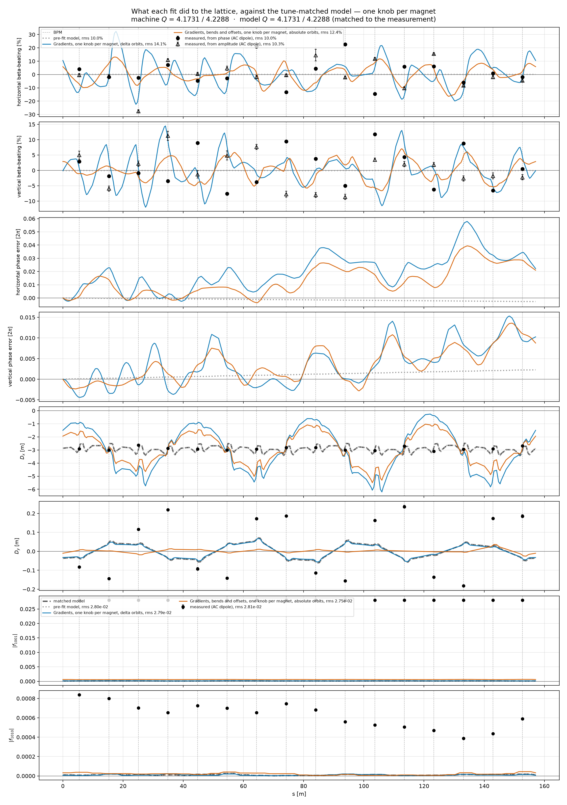
    <figcaption>Beta-beating, phase error and dispersion along s, per case, with the measured beta-beating at the BPMs taken against the model matched to the measured tune.</figcaption>
    </figure>

=== "Normal tunes, sextupoles on, nominal"

    <figure markdown>
    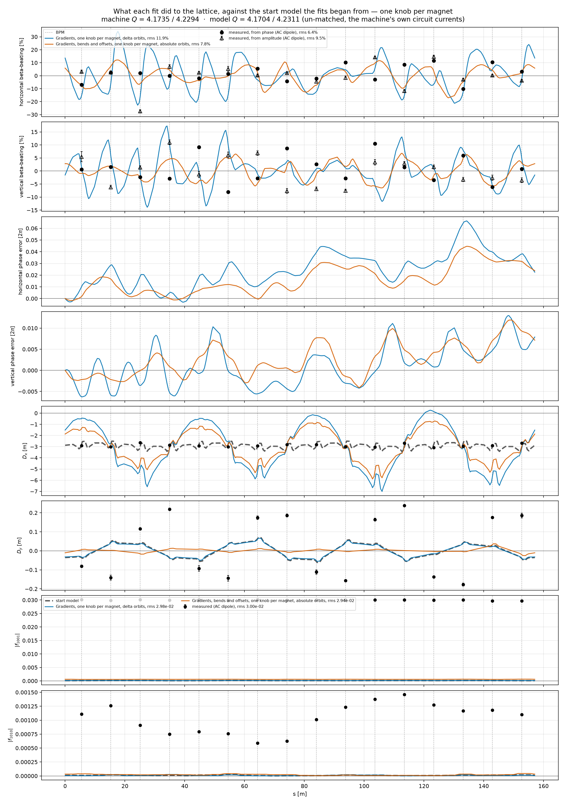
    <figcaption>Beta-beating, phase error and dispersion along s, per case, with the measured beta-beating at the BPMs taken against the model on the $k_1$ sent to the magnets.</figcaption>
    </figure>

=== "Normal tunes, sextupoles on, matched"

    <figure markdown>
    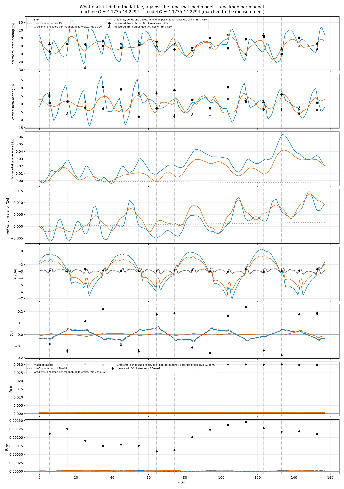
    <figcaption>Beta-beating, phase error and dispersion along s, per case, with the measured beta-beating at the BPMs taken against the model matched to the measured tune.</figcaption>
    </figure>

### Tunes

=== "Normal tunes, 29th"

    <figure markdown>
    
    <figcaption>Where each fit put the tune, against the measured tune, with both model lattices for scale.</figcaption>
    </figure>

=== "Normal tunes, QDE14 error"

    <figure markdown>
    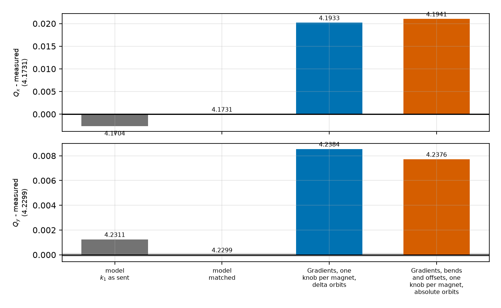
    <figcaption>Where each fit put the tune, against the measured tune, with both model lattices for scale.</figcaption>
    </figure>

=== "Normal tunes, QDE14+QDE3 error"

    <figure markdown>
    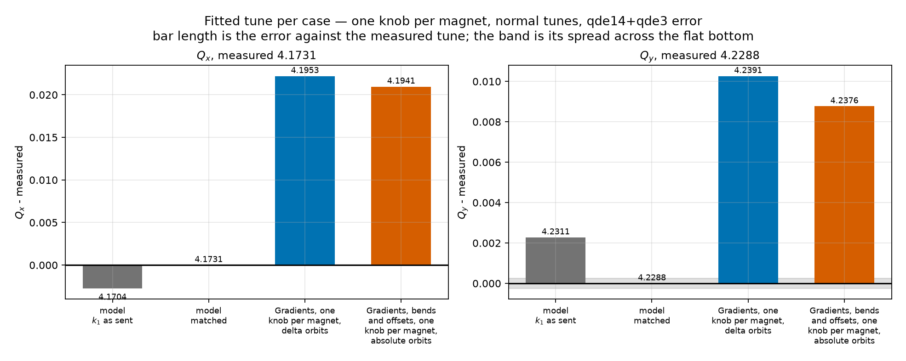
    <figcaption>Where each fit put the tune, against the measured tune, with both model lattices for scale.</figcaption>
    </figure>

=== "Normal tunes, sextupoles on"

    <figure markdown>
    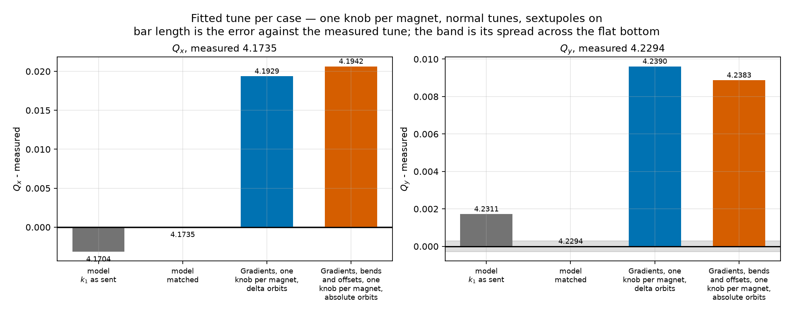
    <figcaption>Where each fit put the tune, against the measured tune, with both model lattices for scale.</figcaption>
    </figure>

### Chromaticity

=== "Normal tunes, 29th"

    <figure markdown>
    
    <figcaption>$dq1$ / $dq2$ error against the measurement, paired bars per case for the two `Dp/p` calibrations (RF-derived chroma, hatched closed-orbit); zero is measured and the band is each calibration's fit $1\sigma$. A case's own fit is one number -- only which measurement it is judged against moves.</figcaption>
    </figure>

=== "Normal tunes, QDE14 error"

    <figure markdown>
    
    <figcaption>$dq1$ / $dq2$ error against the measurement, paired bars per case for the two `Dp/p` calibrations (RF-derived chroma, hatched closed-orbit); zero is measured and the band is each calibration's fit $1\sigma$. A case's own fit is one number -- only which measurement it is judged against moves.</figcaption>
    </figure>

=== "Normal tunes, QDE14+QDE3 error"

    <figure markdown>
    
    <figcaption>$dq1$ / $dq2$ error against the measurement, paired bars per case for the two `Dp/p` calibrations (RF-derived chroma, hatched closed-orbit); zero is measured and the band is each calibration's fit $1\sigma$. A case's own fit is one number -- only which measurement it is judged against moves.</figcaption>
    </figure>

=== "Normal tunes, sextupoles on"

    <figure markdown>
    
    <figcaption>$dq1$ / $dq2$ error against the measurement, paired bars per case for the two `Dp/p` calibrations (RF-derived chroma, hatched closed-orbit); zero is measured and the band is each calibration's fit $1\sigma$. A case's own fit is one number -- only which measurement it is judged against moves.</figcaption>
    </figure>

## Residuals

=== "Normal tunes, 29th"

    <figure markdown>
    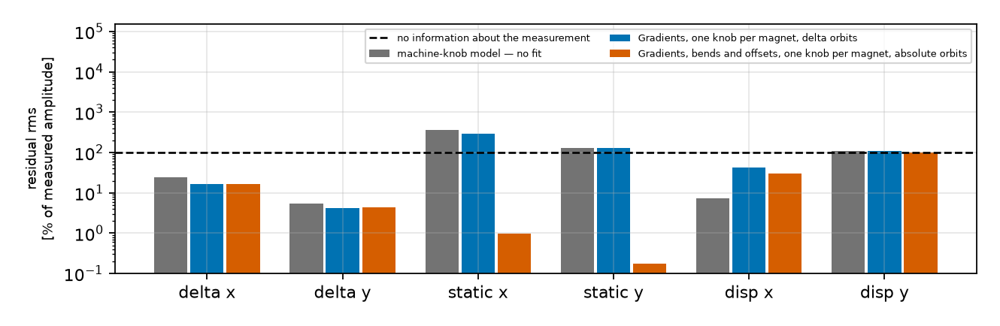
    <figcaption>Residual rms against each scored measurement, per case, as a percentage of the measured amplitude.</figcaption>
    </figure>

    <figure markdown>
    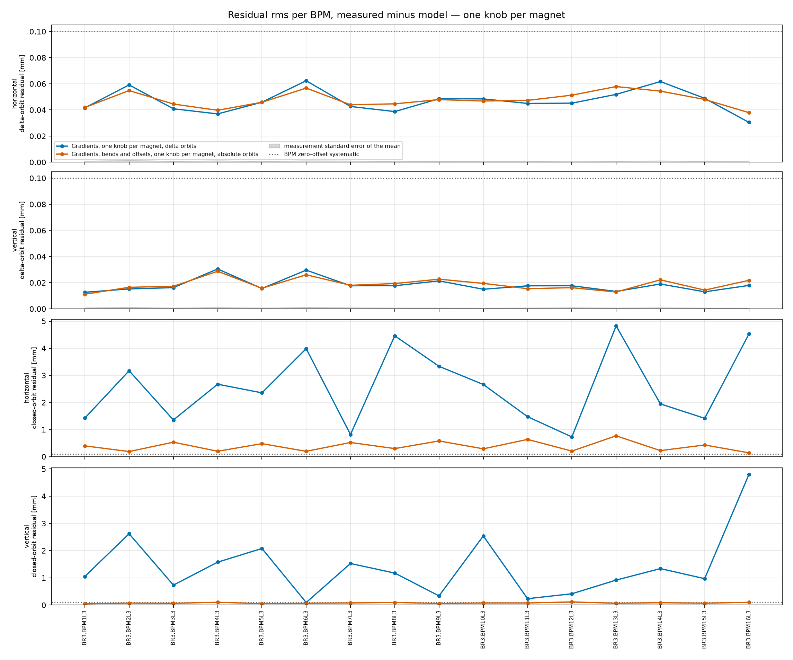
    <figcaption>Residual rms per BPM, with the measurement's statistical bar and the 0.1 mm BPM zero-offset systematic.</figcaption>
    </figure>

=== "Normal tunes, QDE14 error"

    <figure markdown>
    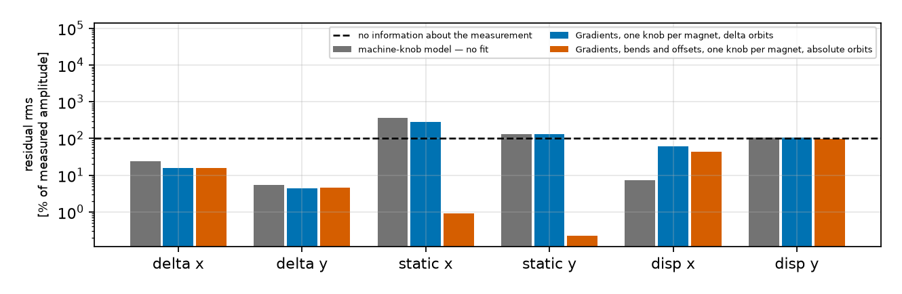
    <figcaption>Residual rms against each scored measurement, per case, as a percentage of the measured amplitude.</figcaption>
    </figure>

    <figure markdown>
    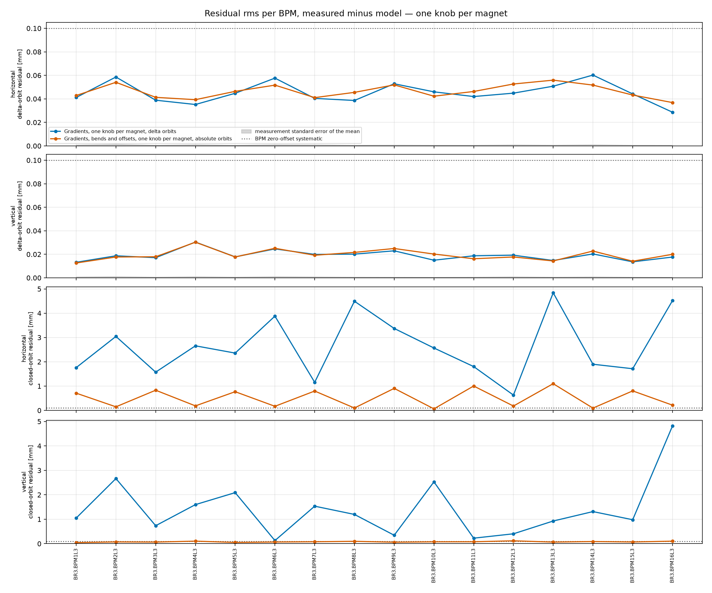
    <figcaption>Residual rms per BPM, with the measurement's statistical bar and the 0.1 mm BPM zero-offset systematic.</figcaption>
    </figure>

=== "Normal tunes, QDE14+QDE3 error"

    <figure markdown>
    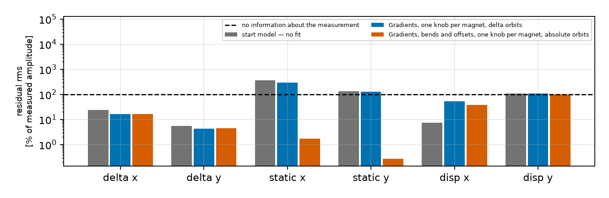
    <figcaption>Residual rms against each scored measurement, per case, as a percentage of the measured amplitude.</figcaption>
    </figure>

    <figure markdown>
    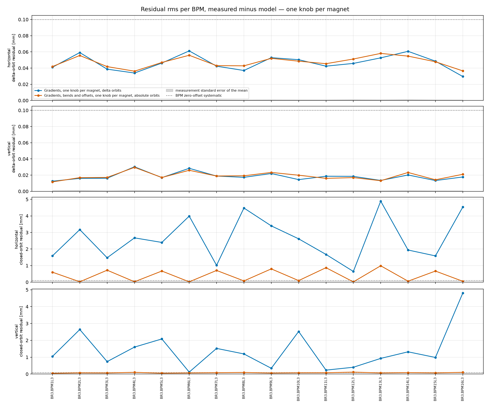
    <figcaption>Residual rms per BPM, with the measurement's statistical bar and the 0.1 mm BPM zero-offset systematic.</figcaption>
    </figure>

=== "Normal tunes, sextupoles on"

    <figure markdown>
    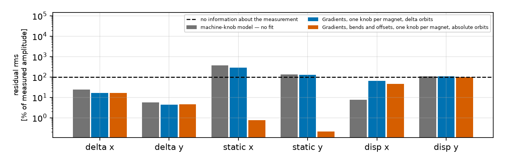
    <figcaption>Residual rms against each scored measurement, per case, as a percentage of the measured amplitude.</figcaption>
    </figure>

    <figure markdown>
    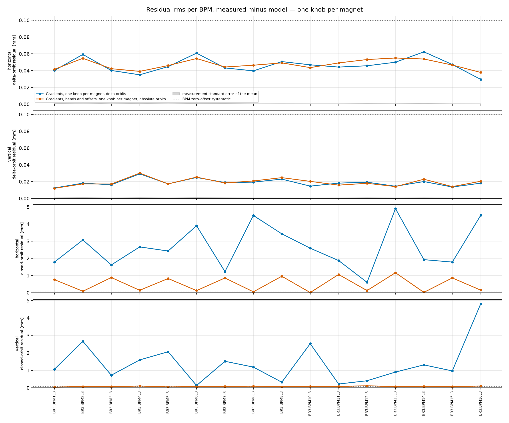
    <figcaption>Residual rms per BPM, with the measurement's statistical bar and the 0.1 mm BPM zero-offset systematic.</figcaption>
    </figure>

---

## Rerunning this page

=== "Normal tunes, 29th"

    ```bash
    uv run python scripts/measured_optics.py --campaign normal_second
    uv run python scripts/run_campaign_fits.py --campaign normal_second --cases \
        none__k1__none \
        xy__k1+b+dy__none
    uv run python scripts/predict_loco.py --campaign normal_second --options \
        none__k1__none \
        xy__k1+b+dy__none
    uv run python scripts/predict_loco.py --campaign normal_second --merge
    uv run python scripts/case_optics.py --campaign normal_second --options \
        none__k1__none \
        xy__k1+b+dy__none
    uv run python scripts/report_cases.py --campaign normal_second --page per-magnet
    uv run python reports/loco_option_matrix/make_pages.py --page per-magnet
    ```

=== "Normal tunes, QDE14 error"

    ```bash
    uv run python scripts/measured_optics.py --campaign normal_qde14_err
    uv run python scripts/run_campaign_fits.py --campaign normal_qde14_err --cases \
        none__k1__none \
        xy__k1+b+dy__none
    uv run python scripts/predict_loco.py --campaign normal_qde14_err --options \
        none__k1__none \
        xy__k1+b+dy__none
    uv run python scripts/predict_loco.py --campaign normal_qde14_err --merge
    uv run python scripts/case_optics.py --campaign normal_qde14_err --options \
        none__k1__none \
        xy__k1+b+dy__none
    uv run python scripts/report_cases.py --campaign normal_qde14_err --page per-magnet
    uv run python reports/loco_option_matrix/make_pages.py --page per-magnet
    ```

=== "Normal tunes, QDE14+QDE3 error"

    ```bash
    uv run python scripts/measured_optics.py --campaign normal_qde14_qde3_err
    uv run python scripts/run_campaign_fits.py --campaign normal_qde14_qde3_err --cases \
        none__k1__none \
        xy__k1+b+dy__none
    uv run python scripts/predict_loco.py --campaign normal_qde14_qde3_err --options \
        none__k1__none \
        xy__k1+b+dy__none
    uv run python scripts/predict_loco.py --campaign normal_qde14_qde3_err --merge
    uv run python scripts/case_optics.py --campaign normal_qde14_qde3_err --options \
        none__k1__none \
        xy__k1+b+dy__none
    uv run python scripts/report_cases.py --campaign normal_qde14_qde3_err --page per-magnet
    uv run python reports/loco_option_matrix/make_pages.py --page per-magnet
    ```

=== "Normal tunes, sextupoles on"

    ```bash
    uv run python scripts/measured_optics.py --campaign normal_sexts_on
    uv run python scripts/run_campaign_fits.py --campaign normal_sexts_on --cases \
        none__k1__none \
        xy__k1+b+dy__none
    uv run python scripts/predict_loco.py --campaign normal_sexts_on --options \
        none__k1__none \
        xy__k1+b+dy__none
    uv run python scripts/predict_loco.py --campaign normal_sexts_on --merge
    uv run python scripts/case_optics.py --campaign normal_sexts_on --options \
        none__k1__none \
        xy__k1+b+dy__none
    uv run python scripts/report_cases.py --campaign normal_sexts_on --page per-magnet
    uv run python reports/loco_option_matrix/make_pages.py --page per-magnet
    ```
