# Scenario comparison

PSB ring 3 · Normal tunes, 29th as the unperturbed baseline, against Normal tunes, QDE14 error, Normal tunes, QDE14+QDE3 error, Normal tunes, sextupoles on. The left column of each perturbation figure is measurement against measurement; the right is the same difference taken between the LOCO-fitted lattices.

## Tune and chromaticity

<figure markdown>
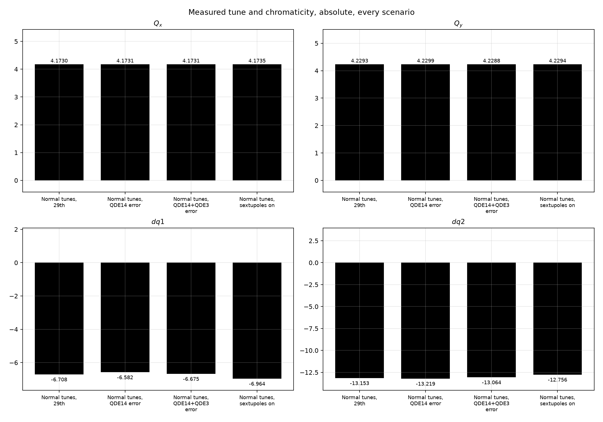
<figcaption>Measured tune and Q'H / Q'V, one group of bars per scenario.</figcaption>
</figure>

<figure markdown>
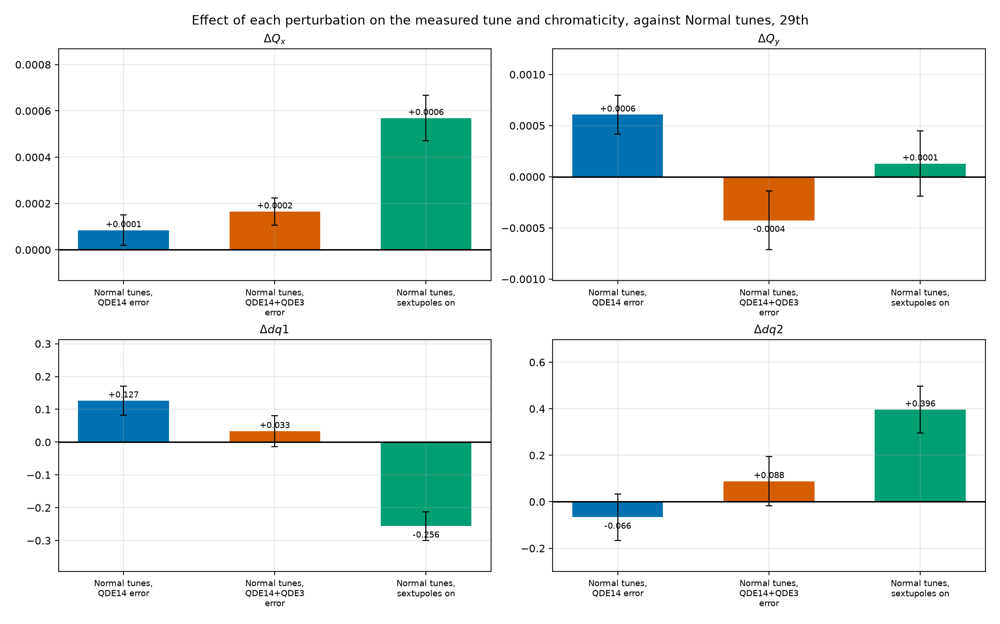
<figcaption>Measured tune and chromaticity, each scenario minus the unperturbed baseline.</figcaption>
</figure>

## Effect of the perturbations

=== "Fitted with gradients only"

    <figure markdown>
    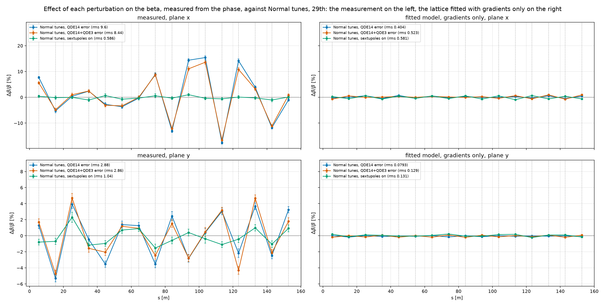
    <figcaption>Relative beta-beating from the measured phase, each scenario minus the unperturbed baseline at the same BPM.</figcaption>
    </figure>

    <figure markdown>
    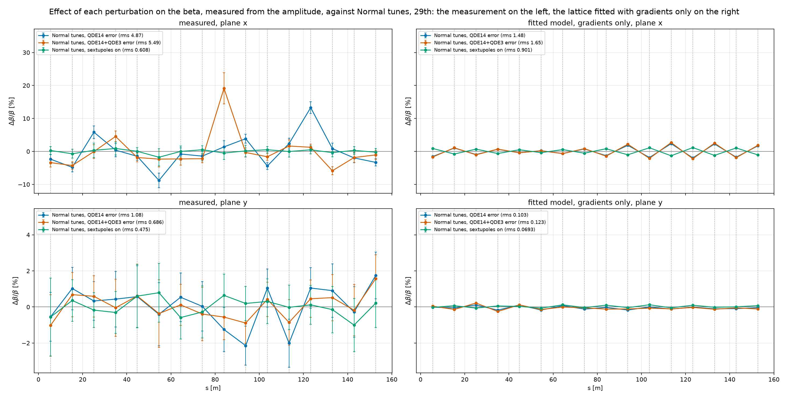
    <figcaption>The same quantity from the measured amplitude, which needs the BPM gains.</figcaption>
    </figure>

    <figure markdown>
    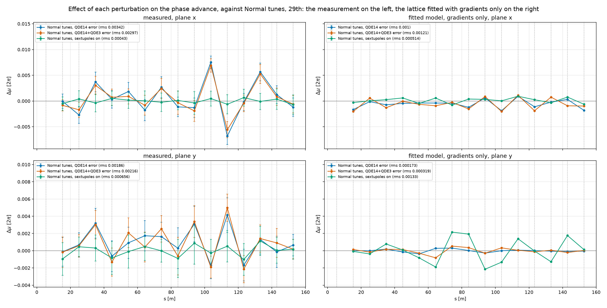
    <figcaption>Phase advance, BPM to BPM, each scenario minus the baseline.</figcaption>
    </figure>

    <figure markdown>
    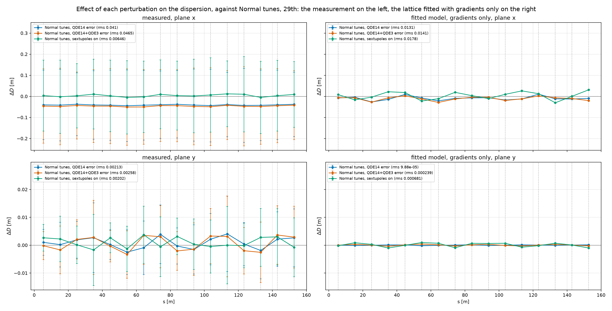
    <figcaption>Dispersion, each scenario minus the baseline, in metres.</figcaption>
    </figure>

    <figure markdown>
    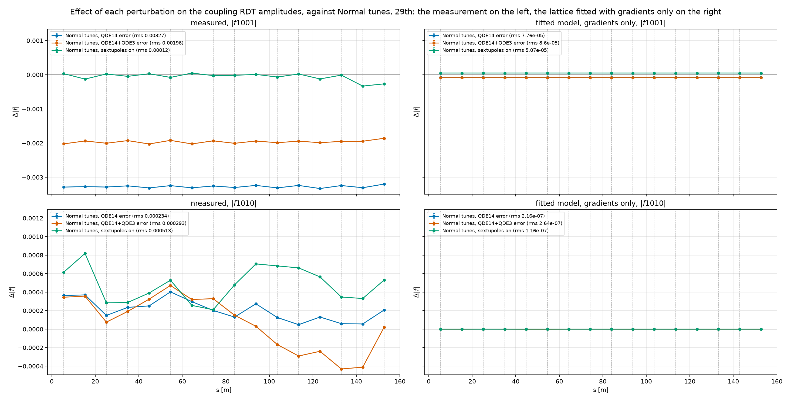
    <figcaption>Coupling RDT amplitudes, each scenario minus the baseline.</figcaption>
    </figure>

=== "Fitted with gradients and rolls"

    <figure markdown>
    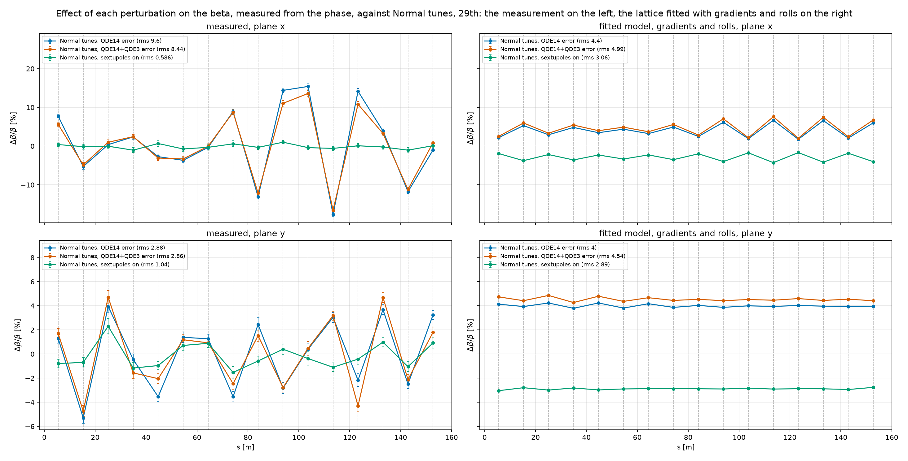
    <figcaption>Relative beta-beating from the measured phase, each scenario minus the unperturbed baseline at the same BPM.</figcaption>
    </figure>

    <figure markdown>
    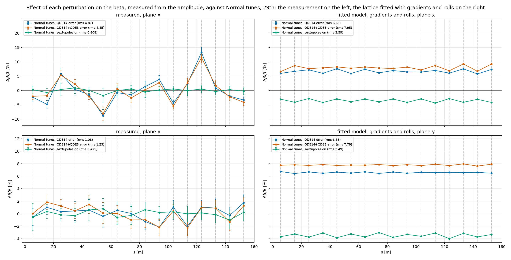
    <figcaption>The same quantity from the measured amplitude, which needs the BPM gains.</figcaption>
    </figure>

    <figure markdown>
    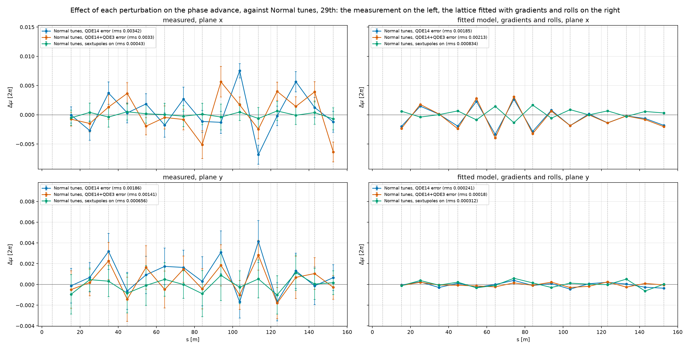
    <figcaption>Phase advance, BPM to BPM, each scenario minus the baseline.</figcaption>
    </figure>

    <figure markdown>
    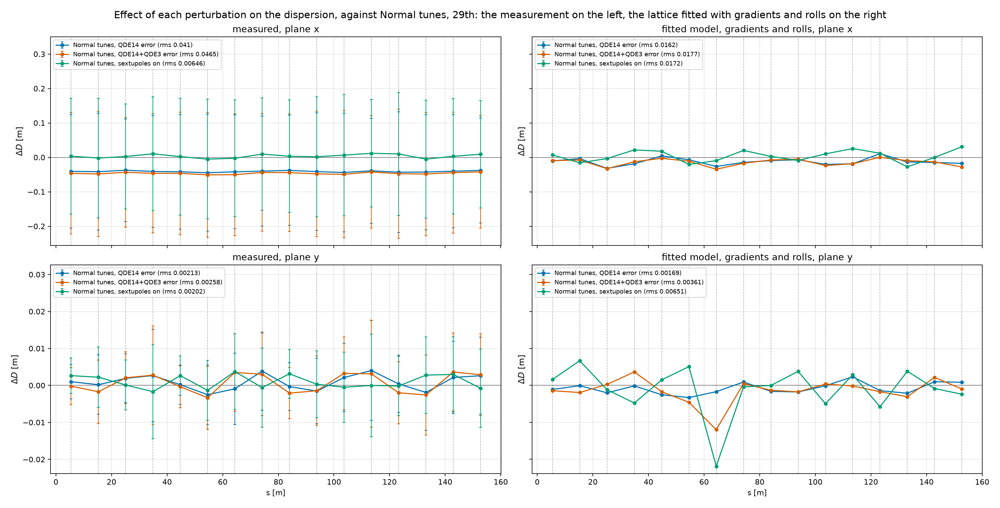
    <figcaption>Dispersion, each scenario minus the baseline, in metres.</figcaption>
    </figure>

    <figure markdown>
    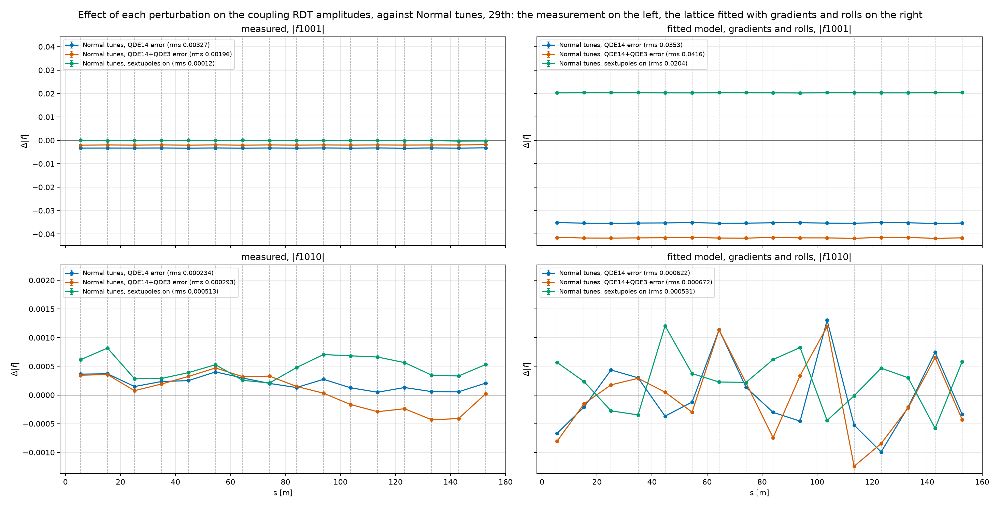
    <figcaption>Coupling RDT amplitudes, each scenario minus the baseline.</figcaption>
    </figure>

## Fitted gradients against the baseline

=== "Multi momentum, gradients"

    <figure markdown>
    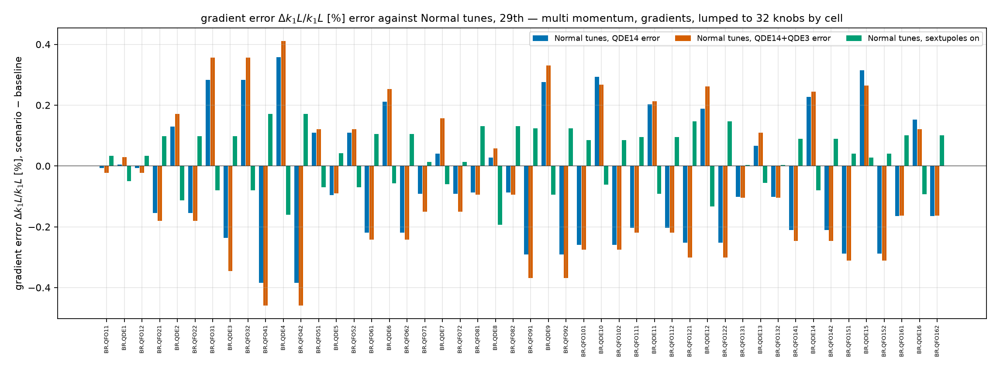
    <figcaption>Fitted gradient per magnet, each scenario minus the unperturbed baseline.</figcaption>
    </figure>

=== "Multi momentum, gradients and rolls"

    <figure markdown>
    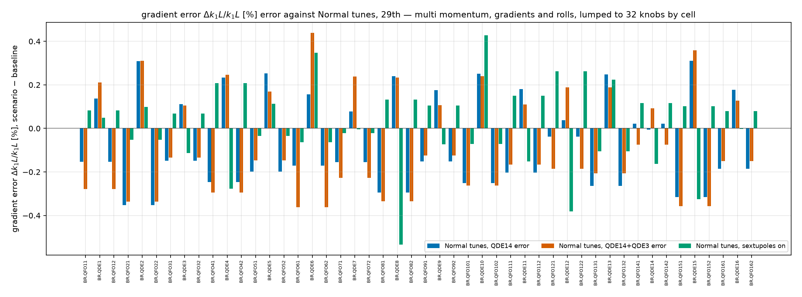
    <figcaption>Fitted gradient per magnet, each scenario minus the unperturbed baseline.</figcaption>
    </figure>

    <figure markdown>
    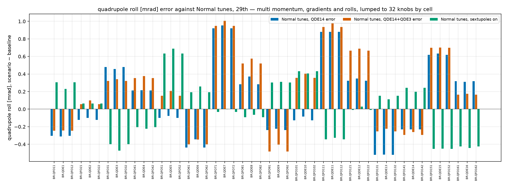
    <figcaption>Fitted roll per magnet, each scenario minus the unperturbed baseline.</figcaption>
    </figure>

=== "Multi momentum, gradients and BPM and corrector gains"

    <figure markdown>
    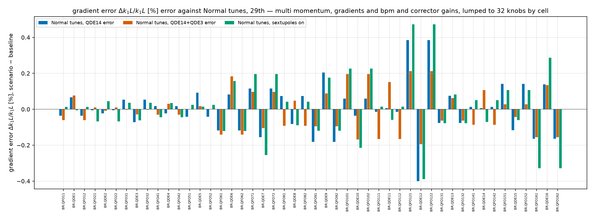
    <figcaption>Fitted gradient per magnet, each scenario minus the unperturbed baseline.</figcaption>
    </figure>
